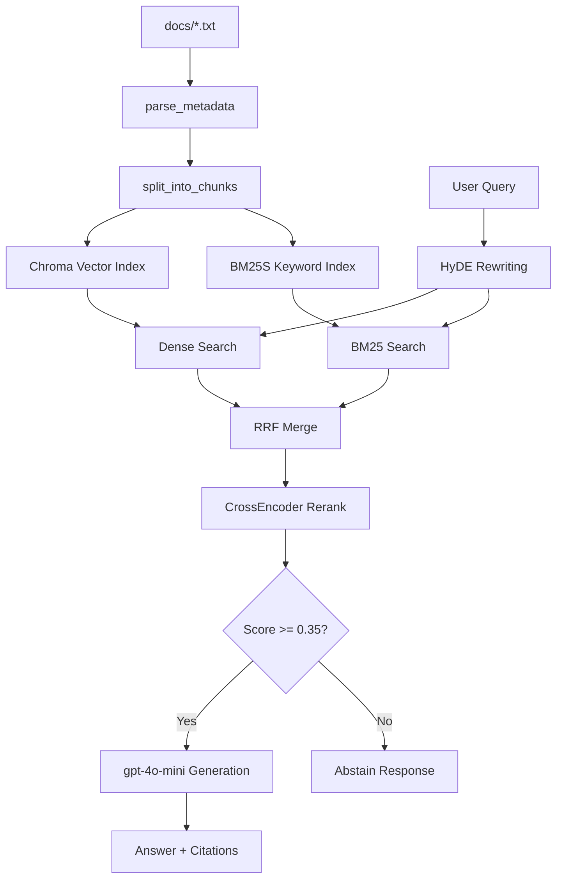

# Phân công công việc — RAG Prototype
## Nhóm 6 người | 4 Sprints × 60 phút | Deadline: 18:00

---

## Tổng quan vai trò

| Thành viên | Vai trò | Thế mạnh khai thác |
|---|---|---|
| **Lê Huy Hồng Nhật** | Tech Lead | RAG experience → chốt kiến trúc, unblock toàn team |
| **Nguyễn Quốc Khánh** | Retrieval Owner | LangChain → chunking + hybrid search |
| **Nguyễn Tuấn Khải** | Retrieval Owner (pair) | LangChain → BM25S + reranking |
| **Phan Văn Tấn** | Eval Owner | LLM API → eval.py + scorecard |
| **Lê Công Thành** | Eval Owner (pair) | LLM API → RAGAS metrics + grading run |
| **Nguyễn Quế Sơn** | Documentation Owner | Tổng hợp → architecture.md + reports |

> **Nguyên tắc điểm cá nhân:** Mỗi người phải có **commit có tên/initials** trong đúng file mình phụ trách.  
> Mọi quyết định kỹ thuật phải được ghi rõ trong `tuning-log.md` với tên người quyết định.

---

## Phân công chi tiết theo Sprint

---

### 🔧 SPRINT 1 — Xây dựng Index (60 phút)
**File chính:** `index.py`  
**Mục tiêu:** Có `index.py` chạy được, `list_chunks()` trả về chunks đúng format với đủ metadata.

---

#### Lê Huy Hồng Nhật — Tech Lead
**Thời gian:** Toàn bộ Sprint 1

**Nhiệm vụ:**
1. Setup repo: tạo cấu trúc thư mục, `.env`, `requirements.txt`, `config.py`
2. Viết skeleton `index.py` với các function stubs:
   - `parse_metadata(file_path) -> dict`
   - `split_into_chunks(content, metadata) -> List[Document]`
   - `build_vector_index(docs) -> Chroma`
   - `list_chunks(vectorstore) -> None` *(debug utility)*
3. Chốt **chunking strategy**: semantic split theo `===` heading, KHÔNG dùng character split cứng
4. Chốt **metadata schema** bắt buộc cho cả team:

```python
# Schema chuẩn — mọi chunk phải có đủ 3 trường này
metadata = {
    "source": "support/sla-p1-2026.pdf",   # từ header file
    "section": "Phần 2: SLA theo mức độ ưu tiên",  # tên section
    "effective_date": "2026-01-15",          # từ header file
    # Optional nhưng nên có:
    "department": "IT",
    "chunk_id": "sla_p1_sec2_chunk0",
    "aliases": []
}
```

5. Review và merge PR của Khánh + Khải trước khi hết Sprint 1

**Commit message format:** `[NHat][S1] setup repo structure + index.py skeleton`

---

#### Nguyễn Quốc Khánh — Retrieval Owner
**Thời gian:** Toàn bộ Sprint 1

**Nhiệm vụ:**
1. Nhận skeleton từ Nhật, implement `parse_metadata()`:

```python
# src/ingestion.py — Khánh owns file này
import re
from pathlib import Path
from langchain.schema import Document

def parse_metadata(content: str) -> dict:
    """Extract Source, Department, Effective Date, Access từ header"""
    meta = {}
    pattern = re.compile(r"^(Source|Department|Effective Date|Access):\s*(.+)$", re.MULTILINE)
    for m in pattern.finditer(content):
        key = m.group(1).lower().replace(" ", "_")
        meta[key] = m.group(2).strip()
    return meta
```

2. Implement `split_into_chunks()` — split theo `===` section headers:

```python
def split_into_chunks(content: str, base_meta: dict) -> list[Document]:
    """Semantic split theo section headers ===...==="""
    section_pattern = re.compile(r"={3,}\s*(.+?)\s*={3,}", re.MULTILINE)
    matches = list(section_pattern.finditer(content))
    chunks = []
    for i, match in enumerate(matches):
        title = match.group(1).strip()
        start = match.end()
        end = matches[i+1].start() if i+1 < len(matches) else len(content)
        body = content[start:end].strip()
        if not body:
            continue
        chunk_text = f"[{title}]\n{body}"
        meta = {**base_meta, "section": title, "chunk_id": f"sec{i}"}
        chunks.append(Document(page_content=chunk_text, metadata=meta))
    return chunks
```

3. Xử lý **alias đặc biệt** cho `access_control_sop.txt`:

```python
ALIAS_MAP = {
    "it/access-control-sop.md": ["approval matrix for system access", "approval matrix"]
}
# Append alias vào chunk đầu tiên để BM25 có thể match
```

4. Viết `list_chunks()` để verify:

```python
def list_chunks(vectorstore):
    """In preview 10 chunks đầu để kiểm tra"""
    results = vectorstore.get(limit=10)
    for i, (doc, meta) in enumerate(zip(results['documents'], results['metadatas'])):
        print(f"[{i}] source={meta.get('source')} | section={meta.get('section')}")
        print(f"    preview: {doc[:80]}...")
```

**Commit message format:** `[Khanh][S1] implement parse_metadata + semantic chunking`

---

#### Nguyễn Tuấn Khải — Retrieval Owner (pair)
**Thời gian:** Toàn bộ Sprint 1

**Nhiệm vụ:**
1. Implement `build_vector_index()` — build Chroma với OpenAI embeddings:

```python
# src/indexing.py — Khải owns file này
import os
from pathlib import Path
from langchain_openai import OpenAIEmbeddings
from langchain_community.vectorstores import Chroma
from langchain.schema import Document

def build_vector_index(documents: list[Document]) -> Chroma:
    """Build hoặc load Chroma vector store"""
    embedding_fn = OpenAIEmbeddings(
        model=os.getenv("OPENAI_EMBEDDING_MODEL", "text-embedding-3-small")
    )
    persist_dir = os.getenv("CHROMA_PERSIST_DIR", "./data/chroma_db")
    os.makedirs(persist_dir, exist_ok=True)

    if Path(persist_dir).exists() and any(Path(persist_dir).iterdir()):
        print("[Chroma] Loading existing index...")
        return Chroma(persist_directory=persist_dir, embedding_function=embedding_fn)

    print(f"[Chroma] Building index from {len(documents)} chunks...")
    return Chroma.from_documents(
        documents=documents,
        embedding=embedding_fn,
        persist_directory=persist_dir,
    )
```

2. Implement **BM25S index** và lưu ra file:

```python
import bm25s, pickle

def build_bm25_index(documents: list[Document]) -> tuple:
    """Build BM25S sparse index"""
    index_dir = Path("./data/bm25_index")
    index_dir.mkdir(parents=True, exist_ok=True)

    corpus = [doc.page_content for doc in documents]
    tokens = bm25s.tokenize(corpus, stopwords=None)

    retriever = bm25s.BM25()
    retriever.index(tokens)

    # Persist
    with open(index_dir / "bm25.pkl", "wb") as f:
        pickle.dump(retriever, f)
    with open(index_dir / "docs.pkl", "wb") as f:
        pickle.dump(documents, f)

    print(f"[BM25S] Index built: {len(documents)} docs")
    return retriever, documents
```

3. Viết `index.py` main — orchestrate toàn bộ Phase 1:

```python
# index.py — entry point Sprint 1
from src.ingestion import parse_metadata, split_into_chunks
from src.indexing import build_vector_index, build_bm25_index, list_chunks
from pathlib import Path

def build_all(docs_dir="./docs"):
    all_chunks = []
    for filepath in Path(docs_dir).glob("*.txt"):
        content = filepath.read_text(encoding="utf-8")
        meta = parse_metadata(content)
        chunks = split_into_chunks(content, meta)
        all_chunks.extend(chunks)
        print(f"  {filepath.name}: {len(chunks)} chunks")

    print(f"\nTotal: {len(all_chunks)} chunks")
    chroma = build_vector_index(all_chunks)
    bm25, docs = build_bm25_index(all_chunks)
    list_chunks(chroma)  # verify
    return chroma, bm25, docs

if __name__ == "__main__":
    build_all()
```

4. Test: chạy `python index.py`, confirm output ra 5 files × N chunks, không có chunk rỗng

**Commit message format:** `[Khai][S1] implement chroma + bm25s indexing + index.py main`

---

#### Phan Văn Tấn, Lê Công Thành, Nguyễn Quế Sơn
**Sprint 1:** Setup môi trường cá nhân

**Tấn + Thành:**
- Clone repo, `pip install -r requirements.txt`
- Tạo file `.env` với API key cá nhân (test)
- Đọc kỹ `test_questions.json` — hiểu rõ 10 câu hỏi, đặc biệt q07 (alias), q09 (abstain), q10 (VIP gap)
- Chuẩn bị skeleton `eval.py` với function stubs (sẽ implement Sprint 3-4)
- Ghi nhận: câu nào expected_sources rỗng → đây là abstain case

**Quế Sơn:**
- Clone repo, setup môi trường
- Tạo file `docs/architecture.md` với template rỗng (sẽ điền dần)
- Tạo file `docs/tuning-log.md` với bảng template:

```markdown
# Tuning Log

| Sprint | Người thực hiện | Thay đổi | Metric trước | Metric sau | Quyết định |
|---|---|---|---|---|---|
| S2 | | Dense baseline | - | - | |
| S3 | | Hybrid variant | | | |
```

- Vẽ sơ đồ pipeline draft (có thể dùng Mermaid hoặc ASCII)

**Commit:** `[Son][S1] init architecture.md + tuning-log.md templates`

---

### 🔍 SPRINT 2 — Baseline Retrieval & Answer (60 phút)
**File chính:** `rag_answer.py`  
**Mục tiêu:** `rag_answer.py` chạy được với Dense Search, trả lời có citation, abstain đúng với q09.

---

#### Lê Huy Hồng Nhật — Tech Lead
**Nhiệm vụ:**
1. Viết **System Prompt** chuẩn với grounding rules — đây là phần quan trọng nhất Sprint 2:

```python
SYSTEM_PROMPT = """Bạn là trợ lý hỗ trợ nội bộ. Chỉ trả lời dựa trên CONTEXT được cung cấp.

QUY TẮC BẮT BUỘC:
1. Nếu CONTEXT không có thông tin → trả lời CHÍNH XÁC: "Không tìm thấy thông tin về [chủ đề] trong tài liệu."
2. KHÔNG được suy diễn hoặc thêm thông tin ngoài context (Hallucination = -50% điểm câu đó).
3. Luôn trích dẫn nguồn dạng [1], [2] sau mỗi câu trả lời.
4. Trả lời ngắn gọn, chính xác."""
```

2. Viết `generate_answer()` — core function của `rag_answer.py`:

```python
def generate_answer(query: str, reranked_docs, has_context: bool, llm) -> dict:
    if not has_context or not reranked_docs:
        return {
            "answer": f"Không tìm thấy thông tin về câu hỏi này trong tài liệu hiện có.",
            "sources": [],
            "citations": []
        }

    # Build context với citation markers [1], [2]...
    context_parts = []
    for i, (doc, score) in enumerate(reranked_docs, 1):
        src = doc.metadata.get("source", "unknown")
        context_parts.append(f"[{i}] Nguồn: {src}\n{doc.page_content}")

    context_block = "\n\n---\n\n".join(context_parts)
    # ... gọi LLM
```

3. Chốt **threshold abstain** = 0.35 (CrossEncoder score)
4. Review toàn bộ `rag_answer.py` trước khi Tấn + Thành chạy eval

**Commit:** `[NHat][S2] system prompt + generate_answer + abstain logic`

---

#### Nguyễn Quốc Khánh — Retrieval Owner
**Nhiệm vụ:**
1. Implement **Dense Search** (Baseline) trong `rag_answer.py`:

```python
# rag_answer.py — Khánh owns retrieval section
def dense_search(query: str, chroma: Chroma, top_k: int = 5) -> list:
    """Baseline: chỉ dùng vector similarity"""
    results = chroma.similarity_search_with_score(query, k=top_k)
    return [(doc, score) for doc, score in results]
```

2. Implement **Citation formatter** — format [1], [2] trong câu trả lời:

```python
def format_citations(sources: list[str]) -> str:
    """Tạo citation list ở cuối câu trả lời"""
    lines = ["\n\n**Nguồn tham khảo:**"]
    for i, src in enumerate(sources, 1):
        lines.append(f"[{i}] {src}")
    return "\n".join(lines)
```

3. Test thủ công với q01, q02, q05 — confirm có citation

**Commit:** `[Khanh][S2] dense search baseline + citation formatter`

---

#### Nguyễn Tuấn Khải — Retrieval Owner (pair)
**Nhiệm vụ:**
1. Implement **`rag_answer.py` main pipeline** — orchestrate query → retrieve → generate:

```python
# rag_answer.py — Khải owns main pipeline
def answer(query: str, mode: str = "dense") -> dict:
    """
    mode: "dense" (baseline) | "hybrid" (variant Sprint 3)
    """
    # Load indexes (đã build ở Sprint 1)
    chroma, bm25, bm25_docs = load_indexes()
    llm = get_llm()

    # Retrieve
    if mode == "dense":
        candidates = dense_search(query, chroma)
    elif mode == "hybrid":
        candidates = hybrid_search(query, chroma, bm25, bm25_docs)  # Sprint 3

    # Rerank + threshold check
    reranked = rerank(query, candidates)
    has_context = reranked[0][1] >= THRESHOLD if reranked else False

    # Generate
    result = generate_answer(query, reranked, has_context, llm)
    return result

if __name__ == "__main__":
    # CLI usage
    import sys
    query = " ".join(sys.argv[1:]) or "SLA xử lý ticket P1 là bao lâu?"
    result = answer(query)
    print(result["answer"])
```

2. Test với q09 ("ERR-403-AUTH") — phải ra abstain, KHÔNG được có answer bịa

**Commit:** `[Khai][S2] rag_answer.py main pipeline + CLI interface`

---

#### Phan Văn Tấn — Eval Owner
**Nhiệm vụ:**
1. Implement `eval.py` — chạy pipeline trên 10 test questions:

```python
# eval.py — Tấn owns file này
import json
from rag_answer import answer

def run_eval(questions_path: str, mode: str = "dense") -> list[dict]:
    with open(questions_path, encoding="utf-8") as f:
        questions = json.load(f)

    results = []
    for q in questions:
        print(f"Running {q['id']}: {q['question'][:50]}...")
        result = answer(q["question"], mode=mode)
        results.append({
            "id": q["id"],
            "question": q["question"],
            "answer": result["answer"],
            "sources": result["sources"],
            "expected_answer": q["expected_answer"],
            "expected_sources": q["expected_sources"],
            "has_context": result.get("has_context", True),
        })
    return results
```

2. Viết `save_results()` — xuất scorecard ra `results/scorecard_baseline.md`

**Commit:** `[Tan][S2] eval.py run_eval + save_results`

---

#### Lê Công Thành — Eval Owner (pair)
**Nhiệm vụ:**
1. Implement **RAGAS integration** trong `eval.py`:

```python
# eval.py — Thành owns RAGAS section
from ragas import evaluate
from ragas.metrics import faithfulness, answer_relevancy, context_precision, context_recall
from datasets import Dataset

def compute_ragas_scores(results: list[dict]) -> dict:
    dataset = Dataset.from_dict({
        "question":     [r["question"] for r in results],
        "answer":       [r["answer"] for r in results],
        "contexts":     [r.get("contexts", []) for r in results],
        "ground_truth": [r["expected_answer"] for r in results],
    })
    scores = evaluate(dataset, metrics=[
        faithfulness, answer_relevancy, context_precision, context_recall
    ])
    return {
        "faithfulness":      round(scores["faithfulness"], 4),
        "answer_relevancy":  round(scores["answer_relevancy"], 4),
        "context_precision": round(scores["context_precision"], 4),
        "context_recall":    round(scores["context_recall"], 4),
    }
```

2. Implement **Abstain Accuracy** custom metric:

```python
def compute_abstain_accuracy(results: list[dict]) -> float:
    """Tỷ lệ câu hỏi không có context mà pipeline đúng abstain"""
    abstain_cases = [r for r in results if r["expected_sources"] == []]
    if not abstain_cases:
        return 1.0
    correct = sum(
        1 for r in abstain_cases
        if not r["has_context"] or "không tìm thấy" in r["answer"].lower()
    )
    return round(correct / len(abstain_cases), 4)
```

**Commit:** `[Thanh][S2] RAGAS integration + abstain_accuracy metric`

---

#### Nguyễn Quế Sơn — Documentation Owner
**Sprint 2:** Cập nhật tài liệu song song với team code

**Nhiệm vụ:**
1. Điền `docs/architecture.md` phần Sprint 1 + 2 — mô tả chunking strategy đã chọn, metadata schema, lý do dùng semantic split thay vì character split
2. Ghi nhận vào `tuning-log.md` quyết định của Nhật về threshold = 0.35 và system prompt
3. Tạo **Mermaid diagram** trong `architecture.md`:

```markdown
## Pipeline Diagram


```

**Commit:** `[Son][S2] architecture.md pipeline diagram + tuning-log S1-S2`

---

### ⚡ SPRINT 3 — Tuning & Variant (60 phút)
**File chính:** `rag_answer.py` (thêm Hybrid mode)  
**Mục tiêu:** Implement Hybrid Search, chạy A/B test Dense vs Hybrid, ghi kết quả vào `tuning-log.md`.

---

#### Lê Huy Hồng Nhật — Tech Lead
**Nhiệm vụ:**
1. Review Hybrid Search của Khánh + Khải, đảm bảo RRF merge đúng
2. Chốt cấu hình tốt nhất: điều chỉnh `TOP_K`, `THRESHOLD` nếu cần sau khi xem kết quả A/B
3. Viết **`results/scorecard_baseline.md`** từ kết quả eval dense
4. Chuẩn bị cấu hình cho **Grading Run** lúc 17:00:

```python
# config tốt nhất để dùng lúc 17:00
BEST_CONFIG = {
    "mode": "hybrid",          # Hoặc "dense" tùy A/B result
    "top_k_retrieval": 10,
    "top_k_rerank": 3,
    "threshold": 0.35,
    "use_hyde": True,
}
```

**Commit:** `[NHat][S3] finalize hybrid config + scorecard_baseline.md`

---

#### Nguyễn Quốc Khánh — Retrieval Owner
**Nhiệm vụ:**
1. Implement **Hybrid Search** (Variant) — bổ sung vào `rag_answer.py`:

```python
# rag_answer.py — Khánh implements hybrid
def hybrid_search(query: str, chroma, bm25, bm25_docs, top_k=10) -> list:
    """
    Hybrid = Dense (Chroma) + Sparse (BM25S) → RRF merge
    Tại sao dùng Hybrid ở đây:
    - Bộ tài liệu có nhiều thuật ngữ kỹ thuật chính xác: P1, P2, ERR-403, Level 3
    - Dense search có thể miss exact match (e.g. "ERR-403-AUTH")
    - BM25 bắt được keyword chính xác, Dense bắt được ngữ nghĩa
    - RRF merge lấy điểm tốt nhất từ cả hai
    """
    # Dense results
    dense = chroma.similarity_search_with_score(query, k=top_k)

    # Sparse results
    q_tokens = bm25s.tokenize([query], stopwords=None)
    sparse_docs, sparse_scores = bm25.retrieve(q_tokens, corpus=bm25_docs, k=top_k)
    sparse = list(zip(sparse_docs[0], sparse_scores[0]))

    # RRF merge (k=60)
    scores = {}
    for rank, (doc, _) in enumerate(dense):
        cid = doc.metadata.get("chunk_id", doc.page_content[:40])
        scores[cid] = (doc, scores.get(cid, (doc, 0))[1] + 1/(60+rank))

    for rank, (doc, _) in enumerate(sparse):
        cid = doc.metadata.get("chunk_id", doc.page_content[:40])
        scores[cid] = (doc, scores.get(cid, (doc, 0))[1] + 1/(60+rank))

    return sorted(scores.values(), key=lambda x: x[1], reverse=True)[:top_k]
```

**Commit:** `[Khanh][S3] hybrid search + RRF merge implementation`

---

#### Nguyễn Tuấn Khải — Retrieval Owner (pair)
**Nhiệm vụ:**
1. Implement **Query Rewriting (HyDE)** — bổ sung vào `rag_answer.py`:

```python
HYDE_PROMPT = """Viết đoạn văn ~80 từ trả lời câu hỏi sau dựa trên kiến thức về IT/HR/chính sách công ty.
Đây là đoạn giả định để tăng chất lượng tìm kiếm.
Câu hỏi: {query}
Trả lời:"""

def rewrite_query_hyde(query: str, llm) -> str:
    """HyDE: tạo hypothetical document để embed thay vì embed câu hỏi gốc"""
    try:
        resp = llm.invoke(HYDE_PROMPT.format(query=query))
        return f"{query}\n\n{resp.content.strip()}"
    except:
        return query  # fallback
```

2. Chạy **A/B test** thủ công trên 5 câu đại diện:

```
Dense vs Hybrid trên: q01, q03, q07 (alias), q09 (abstain), q10 (VIP)
Ghi lại: câu nào Dense đúng mà Hybrid sai? Và ngược lại?
```

3. Điền kết quả A/B vào `tuning-log.md`

**Commit:** `[Khai][S3] HyDE query rewriting + AB test results`

---

#### Phan Văn Tấn — Eval Owner
**Nhiệm vụ:**
1. Chạy `eval.py` với **mode="dense"** → lưu ra `results/scorecard_baseline.md`
2. Chạy `eval.py` với **mode="hybrid"** → lưu ra `results/scorecard_variant.md`
3. Format scorecard chuẩn:

```markdown
# Scorecard — Baseline (Dense Search)
**Thời gian chạy:** Sprint 3 | **Người chạy:** Phan Văn Tấn

## RAGAS Metrics
| Metric | Score | Target | Status |
|---|---|---|---|
| Faithfulness | 0.xx | > 0.90 | ✅/❌ |
| Answer Relevancy | 0.xx | > 0.85 | ✅/❌ |
| Context Precision | 0.xx | > 0.80 | ✅/❌ |
| Context Recall | 0.xx | > 0.80 | ✅/❌ |
| Abstain Accuracy | 0.xx | = 1.00 | ✅/❌ |

## Per-question Results
| ID | Category | Expected | Got | Pass? |
...
```

**Commit:** `[Tan][S3] run baseline eval + scorecard_baseline.md`

---

#### Lê Công Thành — Eval Owner (pair)
**Nhiệm vụ:**
1. Chạy eval Hybrid variant → `results/scorecard_variant.md`
2. Viết **so sánh Dense vs Hybrid** — analysis ngắn (5-10 dòng):

```markdown
## So sánh Baseline vs Variant

| Câu | Dense | Hybrid | Winner | Lý do |
|---|---|---|---|---|
| q07 (alias) | ❌ | ✅ | Hybrid | BM25 bắt được "Approval Matrix" |
| q09 (abstain)| ✅ | ✅ | Tie | Cả hai abstain đúng |
| q01 (SLA P1) | ✅ | ✅ | Tie | |
```

3. Implement **`logs/grading_run.json`** formatter — chuẩn bị sẵn cho 17:00:

```python
def save_grading_log(results: list[dict], output_path: str = "logs/grading_run.json"):
    """Export kết quả ra đúng format nộp bài — phải là array of objects theo SCORING.md"""
    import json, os
    from datetime import datetime
    os.makedirs("logs", exist_ok=True)
    log = []
    for r in results:
        log.append({
            "id": r["id"],
            "question": r["question"],
            "answer": r["answer"],
            "sources": r["sources"],
            "chunks_retrieved": len(r.get("chunks_used", [])),   # ← bắt buộc theo SCORING.md
            "retrieval_mode": r.get("config", {}).get("retrieval_mode", "hybrid"),  # ← bắt buộc
            "timestamp": datetime.now().isoformat(),
        })
    with open(output_path, "w", encoding="utf-8") as f:
        json.dump(log, f, ensure_ascii=False, indent=2)
    print(f"Grading log saved to {output_path} ({len(log)} entries)")
```

> ⚠️ **Format bắt buộc:** `grading_run.json` phải là **array `[...]`**, mỗi entry có đủ `id`, `question`, `answer`, `sources`, `chunks_retrieved`, `retrieval_mode`, `timestamp`. Sai format → câu đó không được tính điểm.

**Commit:** `[Thanh][S3] scorecard_variant.md + grading_run formatter`

---

#### Nguyễn Quế Sơn — Documentation Owner
**Nhiệm vụ:**
1. Điền đầy đủ `docs/tuning-log.md` từ kết quả A/B test của Khải
2. Cập nhật `docs/architecture.md` phần "Retrieval Variants":

```markdown
## Retrieval Strategy

### Baseline: Dense Search
- Chroma similarity search, top-k=5
- Điểm yếu: miss exact keyword (ERR-403, "Approval Matrix")

### Variant: Hybrid Search (Đã chọn)
- Dense (Chroma) + Sparse (BM25S) → RRF merge, top-k=10 → rerank top-3
- Lý do chọn: bộ tài liệu có nhiều mã lỗi kỹ thuật và tên tài liệu chính xác
- Kết quả A/B: +X% context recall trên q07, q09 giữ nguyên abstain
```

3. Bắt đầu viết **`reports/group_report.md`** phần Introduction + Methodology

**Commit:** `[Son][S3] tuning-log complete + architecture variants + group_report draft`

---

### 📊 SPRINT 4 — Evaluation & Báo cáo (60 phút)
**Mục tiêu:** Hoàn thiện tất cả deliverables, sẵn sàng cho Grading Run lúc 17:00.

---

#### Lê Huy Hồng Nhật — Tech Lead
**Nhiệm vụ:**
1. Final review toàn bộ code: `index.py`, `rag_answer.py`, `eval.py`
2. Đảm bảo pipeline chạy end-to-end không lỗi:

```bash
python index.py           # rebuild index
python rag_answer.py "SLA P1 là bao lâu?"  # smoke test
python eval.py            # full eval
```

3. Chuẩn bị **runbook cho 17:00**:

```markdown
# Grading Run Runbook (17:00 - 18:00)

17:00  Tải grading_questions.json về → để vào tests/
17:02  python eval.py --input tests/grading_questions.json --mode hybrid
17:15  Kiểm tra logs/grading_run.json — format đúng chưa?
17:20  git add logs/grading_run.json && git commit -m "[ALL][S4] grading run"
17:30  Final check tất cả files deliverable
17:55  git push — TRƯỚC 18:00
```

4. Viết phần kỹ thuật trong `reports/group_report.md`

**Commit:** `[NHat][S4] final review + runbook + group_report tech section`

---

#### Nguyễn Quốc Khánh + Nguyễn Tuấn Khải
**Nhiệm vụ Sprint 4:**
1. **Khánh:** Viết báo cáo cá nhân `reports/individual/khanh.md` (500-800 từ):
   - **Đóng góp cụ thể:** mô tả chi tiết `parse_metadata()`, `split_into_chunks()`, alias handling — có dẫn chứng commit
   - **Phân tích 1 câu grading** (sau 17:00 khi có `grading_questions.json`): chọn câu liên quan đến keyword/alias (gợi ý: câu tương tự q07)
   - **Rút kinh nghiệm:** semantic split vs character split — khó khăn thực tế gặp phải
   - **Đề xuất cải tiến** có evidence từ scorecard

2. **Khải:** Viết báo cáo cá nhân `reports/individual/khai.md` (500-800 từ):
   - **Đóng góp cụ thể:** mô tả chi tiết `build_vector_index()`, `build_bm25_index()`, HyDE — có dẫn chứng commit
   - **Phân tích 1 câu grading** (sau 17:00): chọn câu liên quan đến abstain/threshold (gợi ý: câu tương tự q09)
   - **Rút kinh nghiệm:** HyDE với câu hỏi không có context — khó khăn thực tế
   - **Đề xuất cải tiến** có evidence từ scorecard

3. Cả hai: fix bất kỳ bug nào Nhật báo từ final review

**Commit:** `[Khanh][S4] individual report` / `[Khai][S4] individual report`

---

#### Phan Văn Tấn + Lê Công Thành
**Nhiệm vụ Sprint 4:**
1. **Tấn:** Viết báo cáo cá nhân `reports/individual/tan.md` (500-800 từ):
   - **Đóng góp cụ thể:** mô tả chi tiết `run_eval()`, `save_results()`, scorecard baseline — có dẫn chứng commit
   - **Phân tích 1 câu grading** (sau 17:00): chọn câu liên quan đến hallucination/grounding (gợi ý: câu tương tự q10)
   - **Rút kinh nghiệm:** RAGAS metrics — số nào khó đạt nhất và tại sao
   - **Đề xuất cải tiến** có evidence từ scorecard (ví dụ: "Context Recall chỉ 0.72 vì...")

2. **Thành:** Viết báo cáo cá nhân `reports/individual/thanh.md` (500-800 từ):
   - **Đóng góp cụ thể:** mô tả chi tiết RAGAS integration, abstain_accuracy metric, grading formatter — có dẫn chứng commit
   - **Phân tích 1 câu grading** (sau 17:00): chọn câu multi-document synthesis hoặc câu khó nhất
   - **Rút kinh nghiệm:** Faithfulness vs Answer Relevancy tradeoff thực tế
   - **Đề xuất cải tiến** có evidence từ scorecard

3. Cả hai: test `save_grading_log()` với file grading giả — đảm bảo format JSON array đúng trước 17:00

**Commit:** `[Tan][S4] individual report` / `[Thanh][S4] individual report + grading formatter test`

---

#### Nguyễn Quế Sơn — Documentation Owner
**Nhiệm vụ Sprint 4:**
1. Hoàn thiện `docs/architecture.md` — điền đầy đủ tất cả sections
2. Hoàn thiện `docs/tuning-log.md` — điền kết quả cuối cùng từ scorecard
3. Hoàn thiện `reports/group_report.md` — tổng hợp từ tất cả thành viên:

```markdown
# Group Report — RAG Prototype
**Nhóm:** [Tên nhóm] | **Ngày:** [Ngày nộp]

## 1. Tổng quan kiến trúc
## 2. Quyết định kỹ thuật quan trọng
   - Semantic chunking vs character split (Khánh)
   - Hybrid Search vs Dense only (Khải — A/B test)
   - Threshold abstain = 0.35 (Nhật)
## 3. Kết quả RAGAS
## 4. Phân tích câu hỏi đặc biệt (gq01–gq10 từ grading_questions.json)
## 5. Kết luận và hướng cải thiện
```

4. Xây dựng bản Prototype Web UI (Thuyết trình):
   - Đóng gói giao diện HTML "The Digital Architect".
   - Dựng FastAPI backend phục vụ Demo và Trace Panel.
5. Viết báo cáo cá nhân `reports/individual/son.md` (500-800 từ):
   - **Đóng góp cụ thể:** mô tả chi tiết architecture.md, tuning-log, group_report, **Web UI Demo** — có dẫn chứng commit
   - **Phân tích 1 câu grading** (sau 17:00): chọn câu liên quan đến multi-document hoặc temporal scoping
   - **Rút kinh nghiệm:** khó khăn khi tổng hợp tài liệu từ nhiều thành viên
   - **Đề xuất cải tiến** có evidence từ scorecard

**Commit:** `[Son][S4] architecture.md final + tuning-log final + group_report + individual report`

---

## ⏰ Khung giờ Grading (17:00 – 18:00)

| Thời điểm | Ai | Làm gì |
|---|---|---|
| 17:00 | **Nhật** | Tải `grading_questions.json`, để vào `tests/` |
| 17:01 | **Nhật** | `python eval.py --input tests/grading_questions.json --mode hybrid` |
| 17:10 | **Thành** | Kiểm tra `logs/grading_run.json` — format đúng không |
| 17:15 | **Tấn** | Verify kết quả bất thường (câu nào abstain mà không nên?) |
| 17:20 | **Nhật** | `git commit -m "[ALL][GRADING] grading_run.json final"` |
| 17:30 | **Sơn** | Final check tất cả files trong deliverable list |
| 17:50 | **Nhật** | `git push` — 10 phút buffer trước deadline |
| 18:00 | 🔒 | **GIT LOCK — HARD DEADLINE** |

---

## 📁 Checklist Deliverables

```
rag_prototype/
├── index.py                          ✅ Nhật + Khánh + Khải  [deadline 18:00]
├── rag_answer.py                     ✅ Nhật + Khánh + Khải  [deadline 18:00]
├── eval.py                           ✅ Tấn + Thành           [deadline 18:00]
├── data/
│   ├── docs/                         ✅ Khánh (copy từ docs/)
│   └── test_questions.json           ✅ Tấn
├── logs/
│   └── grading_run.json              ✅ Thành (formatter) + Nhật (chạy)  [deadline 18:00]
├── results/
│   ├── scorecard_baseline.md         ✅ Tấn                  [deadline 18:00]
│   └── scorecard_variant.md          ✅ Thành                [deadline 18:00]
├── docs/
│   ├── architecture.md               ✅ Sơn                  [deadline 18:00]
│   └── tuning-log.md                 ✅ Sơn                  [deadline 18:00]
└── reports/
    ├── group_report.md               ✅ Sơn (tổng hợp)       [SAU 18:00 được]
    └── individual/                   ← ⚠️ phải nằm trong subfolder này
        ├── nhat.md                   ✅ Nhật                  [SAU 18:00 được]
        ├── khanh.md                  ✅ Khánh                 [SAU 18:00 được]
        ├── khai.md                   ✅ Khải                  [SAU 18:00 được]
        ├── tan.md                    ✅ Tấn                   [SAU 18:00 được]
        ├── thanh.md                  ✅ Thành                 [SAU 18:00 được]
        └── son.md                    ✅ Sơn                   [SAU 18:00 được]
```

---

## ⚠️ Luật phạt — Cảnh báo toàn team

> **Bất kỳ vi phạm nào dưới đây → MẤT TOÀN BỘ 40 điểm cá nhân (0/40):**

| Trường hợp | Hệ quả |
|---|---|
| Report khai báo làm Sprint X / file Y nhưng repo không có commit/comment xác nhận | **0/40 điểm cá nhân** |
| Khai báo implement phần mà thực tế người khác làm (xác minh qua commit history) | **0/40 điểm cá nhân** |
| Nội dung phân tích/rút kinh nghiệm trùng lặp đáng kể với report thành viên khác | **0/40 điểm cá nhân** tất cả người liên quan |
| Không giải thích được quyết định kỹ thuật trong phần mình khai báo khi được hỏi | **0/40 điểm cá nhân** |

> **Nguyên tắc:** Mỗi commit phải có tên/initials của bạn. Report là **bằng chứng** — nếu bằng chứng mâu thuẫn với thực tế trong repo, toàn bộ phần cá nhân không có giá trị.

---

## 🎁 Điểm thưởng (Bonus — tối đa +5)

| Hành động | Thưởng | Ai phụ trách |
|---|---|---|
| Implement **LLM-as-Judge** trong `eval.py` thay vì chấm thủ công | +2 | Thành (hoặc Tấn) — Sprint 3–4 |
| Log đủ **10 câu grading** với `timestamp` hợp lệ (trong 17:00–18:00) | +1 | Nhật (verify lúc 17:10) |
| Câu **gq06** (câu khó nhất, 12 điểm raw) đạt **Full marks** | +2 | Toàn team — cần Multi-hop retrieval tốt |

> **Ưu tiên:** Nếu còn thời gian trong Sprint 3–4, Thành implement LLM-as-Judge trước để chắc +2 điểm bonus.

---

## 🎯 Hướng dẫn báo cáo cá nhân (tránh trùng nhau)

> ⚠️ **Quan trọng:** Mục "Phân tích 1 câu grading" phải phân tích câu trong **`grading_questions.json`** (public lúc 17:00, ký hiệu `gq01`–`gq10`), KHÔNG phải câu trong `test_questions.json`. Điền sau khi có kết quả chạy thực tế.

| Thành viên | Câu phân tích gợi ý (xác nhận sau 17:00) | Angle |
|---|---|---|
| **Nhật** | gq06 (câu khó nhất — Multi-hop) | Quyết định kiến trúc: tại sao chọn Hybrid + HyDE + CrossEncoder |
| **Khánh** | gq05 (Multi-section retrieval) hoặc câu alias | Tại sao Dense fail, BM25 + alias metadata giải quyết thế nào |
| **Khải** | gq07 (Abstain — anti-hallucination) | Threshold mechanism, HyDE với câu không có context |
| **Tấn** | gq10 (Temporal scoping) | Grounding prompt ngăn hallucination như thế nào |
| **Thành** | gq02 (Multi-document synthesis) | Faithfulness vs Relevancy tradeoff, Abstain Accuracy |
| **Sơn** | gq01 (Freshness & version reasoning) | Mỗi component giải quyết failure mode gì cụ thể |

---

*Phân công v1.0 — Lê Huy Hồng Nhật (Tech Lead)*  
*Cập nhật lần cuối: trước Sprint 1*