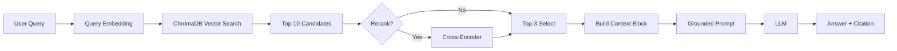

# Architecture — RAG Pipeline (Day 08 Lab)

> Template: Điền vào các mục này khi hoàn thành từng sprint.
> Deliverable của Documentation Owner.

## 1. Tổng quan kiến trúc

```
[Raw Docs]
    ↓
[index.py: Preprocess → Chunk → Embed → Store]
    ↓
[ChromaDB Vector Store]
    ↓
[rag_answer.py: Query → Retrieve → Rerank → Generate]
    ↓
[Grounded Answer + Citation]
```

**Mô tả ngắn gọn:**
> Hệ thống này là một pipeline RAG nội bộ giúp tra cứu nhanh các tài liệu policy, SOP, SLA và FAQ cho đội IT, CS, HR.
> Dữ liệu được index thành các chunk có metadata và lưu trong ChromaDB; khi có câu hỏi, hệ thống retrieve (dense/hybrid), có thể rerank, rồi sinh câu trả lời grounded kèm citation nguồn.
> Mục tiêu là giảm thời gian tìm tài liệu, tăng độ chính xác câu trả lời và hạn chế hallucination nhờ chỉ trả lời từ ngữ cảnh đã truy xuất.

### Phân vai (tham chiếu README)

| Vai trò | Tên | Trách nhiệm chính | Sprint lead |
|---------|-----|------------------|------------|
| **Tech Lead** | Tống Tiến Mạnh | Giữ nhịp sprint, nối code end-to-end | 1, 2 |
| **Retrieval Owner** | Nguyễn Minh Hiếu | Chunking, metadata, retrieval strategy, rerank | 1, 3 |
| **Retrieval Owner** | Nguyễn Tùng Lâm | Chunking, metadata, retrieval strategy, rerank | 1, 3 |
| **Eval Owner** | Nguyễn Việt Long | Test questions, expected evidence, scorecard, A/B | 3, 4 |
| **Eval Owner** | Hà Huy Hoàng | Test questions, expected evidence, scorecard, A/B | 3, 4 |
| **Documentation Owner** | Nguyễn Quang Đăng | architecture.md, tuning-log, báo cáo nhóm | 4 |

---

## 2. Indexing Pipeline (Sprint 1)

### Tài liệu được index
| File | Nguồn | Department | Số chunk |
|------|-------|-----------|---------|
| `policy_refund_v4.txt` | policy/refund-v4.pdf | CS | 6 |
| `sla_p1_2026.txt` | support/sla-p1-2026.pdf | IT | 5 |
| `access_control_sop.txt` | it/access-control-sop.md | IT Security | 8 |
| `it_helpdesk_faq.txt` | support/helpdesk-faq.md | IT | 6 |
| `hr_leave_policy.txt` | hr/leave-policy-2026.pdf | HR | 5 |

### Quyết định chunking
| Tham số | Giá trị | Lý do |
|---------|---------|-------|
| Chunk size | 400 tokens (ước lượng theo `CHUNK_SIZE`) | Cân bằng giữa đủ ngữ cảnh và tránh context quá dài khi retrieve nhiều chunk |
| Overlap | 80 tokens (ước lượng theo `CHUNK_OVERLAP`) | Giữ liên tục ngữ nghĩa giữa các chunk liền kề, giảm mất ý ở ranh giới |
| Chunking strategy | Heading-based, fallback paragraph/size split + overlap | Ưu tiên ranh giới tự nhiên theo `=== Section ... ===`, sau đó mới tách theo paragraph/độ dài |
| Metadata fields | source, section, effective_date, department, access | Phục vụ filter, freshness, citation |

### Embedding model
- **Model**: OpenAI-compatible `text-embedding-3-small` (qua `CUSTOM_API_KEY`)
- **Vector store**: ChromaDB (PersistentClient)
- **Similarity metric**: Cosine

---

## 3. Retrieval Pipeline (Sprint 2 + 3)

### Baseline (Sprint 2)
| Tham số | Giá trị |
|---------|---------|
| Strategy | Dense (embedding similarity) |
| Top-k search | 10 |
| Top-k select | 3 |
| Rerank | Không |

### Variant (Sprint 3)
| Tham số | Giá trị | Thay đổi so với baseline |
|---------|---------|------------------------|
| Strategy | TODO (hybrid / dense) | TODO |
| Top-k search | TODO | TODO |
| Top-k select | TODO | TODO |
| Rerank | TODO (cross-encoder / MMR) | TODO |
| Query transform | TODO (expansion / HyDE / decomposition) | TODO |

**Lý do chọn variant này:**
> TODO: Giải thích tại sao chọn biến này để tune.
> Ví dụ: "Chọn hybrid vì corpus có cả câu tự nhiên (policy) lẫn mã lỗi và tên chuyên ngành (SLA ticket P1, ERR-403)."

---

## 4. Generation (Sprint 2)

### Grounded Prompt Template
```
Answer only from the retrieved context below.
If the context is insufficient, say you do not know.
Cite the source field when possible.
Keep your answer short, clear, and factual.

Question: {query}

Context:
[1] {source} | {section} | score={score}
{chunk_text}

[2] ...

Answer:
```

### LLM Configuration
| Tham số | Giá trị |
|---------|---------|
| Model | TODO (gpt-4o-mini / gemini-1.5-flash) |
| Temperature | 0 (để output ổn định cho eval) |
| Max tokens | 512 |

---

## 5. Failure Mode Checklist

> Dùng khi debug — kiểm tra lần lượt: index → retrieval → generation

| Failure Mode | Triệu chứng | Cách kiểm tra |
|-------------|-------------|---------------|
| Index lỗi | Retrieve về docs cũ / sai version | `inspect_metadata_coverage()` trong index.py |
| Chunking tệ | Chunk cắt giữa điều khoản | `list_chunks()` và đọc text preview |
| Retrieval lỗi | Không tìm được expected source | `score_context_recall()` trong eval.py |
| Generation lỗi | Answer không grounded / bịa | `score_faithfulness()` trong eval.py |
| Token overload | Context quá dài → lost in the middle | Kiểm tra độ dài context_block |

---

## 6. Diagram (tùy chọn)

> TODO: Vẽ sơ đồ pipeline nếu có thời gian. Có thể dùng Mermaid hoặc drawio.


