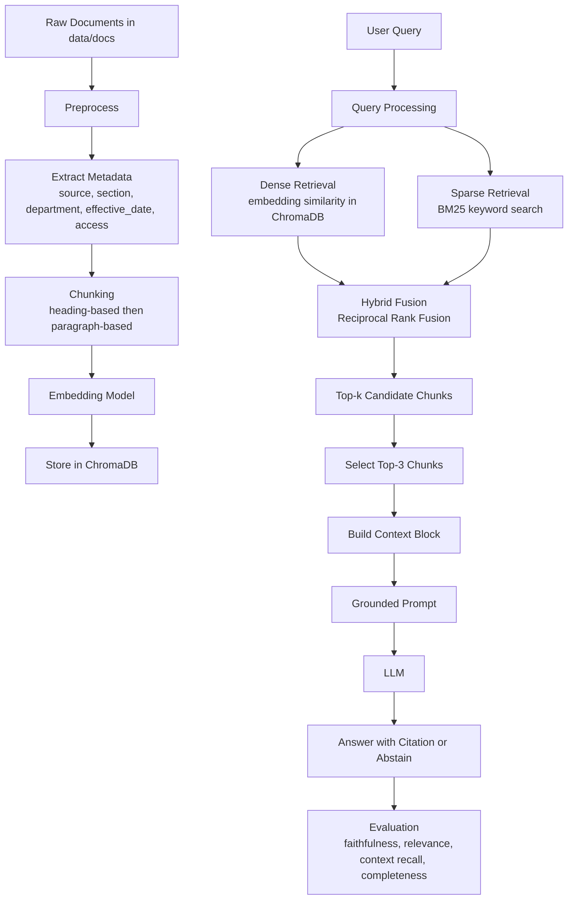

# Architecture — RAG Pipeline (Day 08 Lab)

> Template: Điền vào các mục này khi hoàn thành từng sprint.
> Deliverable của Documentation Owner.

## 1. Tổng quan kiến trúc

```
[Raw Docs]
    ↓
[index.py: Preprocess → Chunk → Embed → Store]
    ↓
[ChromaDB Vector Store]
    ↓
[rag_answer.py: Query → Retrieve → Rerank → Generate]
    ↓
[Grounded Answer + Citation]
```

**Mô tả ngắn gọn:**
> Hệ thống xây dựng một pipeline RAG cho trợ lý nội bộ IT/CS, lấy thông tin từ tài liệu chính sách và FAQ rồi lưu thành vector index để truy vấn nhanh.
> Sprint 1 xử lý phần index: preprocess, chunk, embed và lưu docs vào ChromaDB với metadata để phục vụ retrieval.

---

## 2. Indexing Pipeline (Sprint 1)

### Tài liệu được index
| File                     | Nguồn                    | Department  | Số chunk |
| ------------------------ | ------------------------ | ----------- | -------- |
| `policy_refund_v4.txt`   | policy/refund-v4.pdf     | CS          | 6        |
| `sla_p1_2026.txt`        | support/sla-p1-2026.pdf  | IT          | 5        |
| `access_control_sop.txt` | it/access-control-sop.md | IT Security | 8        |
| `it_helpdesk_faq.txt`    | support/helpdesk-faq.md  | IT          | 6        |
| `hr_leave_policy.txt`    | hr/leave-policy-2026.pdf | HR          | 5        |

### Quyết định chunking
| Tham số           | Giá trị                                             | Lý do                                                                          |
| ----------------- | --------------------------------------------------- | ------------------------------------------------------------------------------ |
| Chunk size        | ~400 tokens (ước lượng ~1600 ký tự)                 | Giữ chunk đủ ngữ cảnh cho retrieval, không quá dài để prompt bị quá tải        |
| Overlap           | ~80 tokens (ước lượng ~320 ký tự)                   | Bảo đảm không mất thông tin giữa các chunk và giữ liên tục khi cắt section dài |
| Chunking strategy | Heading-based + paragraph-based split               | Ưu tiên cắt tại section/paragraph để giữ nguyên ý nghĩa, giảm cắt ngang câu    |
| Metadata fields   | source, section, effective_date, department, access | Giúp citation, lọc tài liệu theo domain và kiểm tra dữ liệu index              |

### Embedding model
- **Model**: OpenAI text-embedding-3-small
- **Vector store**: ChromaDB PersistentClient
- **Similarity metric**: Cosine

### Kết quả Sprint 1
- Tổng số documents index: 5
- Tổng số chunks tạo ra: 30
- Mỗi doc đã index thành 5-8 chunks, metadata đầy đủ và không thiếu source/effective_date

---

## 3. Retrieval Pipeline (Sprint 2 + 3)

### Baseline (Sprint 2)
| Tham số      | Giá trị                        |
| ------------ | ------------------------------ |
| Strategy     | Dense (text-embedding-3-small) |
| Top-k search | 10                             |
| Top-k select | 3                              |
| Rerank       | Không                          |

### Variant (Sprint 3)
| Tham số         | Giá trị                 | Thay đổi so với baseline                           |
| --------------- | ----------------------- | -------------------------------------------------- |
| Strategy        | Hybrid (dense + sparse) | Kết hợp semantic search với BM25 exact-match       |
| Top-k search    | 10                      | Giữ nguyên để so sánh fair với baseline            |
| Top-k select    | 3                       | Giữ nguyên để đảm bảo prompt ngắn gọn              |
| Rerank          | Không                   | Không dùng rerank, chỉ dùng RRF fusion             |
| Query transform | Không                   | Không dùng query expansion / HyDE trong sprint này |

**Lý do chọn variant này:**
> *Nhóm chọn hybrid retrieval vì corpus không chỉ có câu văn tự nhiên mà còn có nhiều từ khóa chuyên biệt như `P1`, `Level 3`, `Approval Matrix`, và tên tài liệu cũ/mới. Dense retrieval phù hợp với truy vấn diễn đạt tự nhiên, nhưng có thể bỏ sót các query dùng alias hoặc exact keyword. Hybrid retrieval kết hợp dense và BM25 giúp giữ được cả semantic match lẫn keyword match, nên phù hợp hơn với tập tài liệu của bài lab.*


---

## 4. Generation (Sprint 2)

### Grounded Prompt Template
```
Chỉ trả lời dựa trên ngữ cảnh được cung cấp bên dưới.
Nếu ngữ cảnh không đủ để trả lời câu hỏi, hãy trả về chính xác câu sau:
không đủ dữ liệu để trả lời.
Khi trả về không đủ dữ liệu, không thêm bất kỳ trích dẫn, giải thích hoặc nội dung nào khác và trả ra source rỗng.
Nếu có đủ dữ liệu để trả lời, BẮT BUỘC phải có ít nhất một citation dạng [n] (ví dụ [1], [2]).
Giữ câu trả lời ngắn gọn, rõ ràng và mang tính.
Trả lời bằng cùng ngôn ngữ với câu hỏi

Question: {query}

Context:
{context_block}

Answer:
```

### LLM Configuration
| Tham số     | Giá trị                        |
| ----------- | ------------------------------ |
| Model       | gpt-4o-mini                    |
| Temperature | 0 (để output ổn định cho eval) |
| Max tokens  | 512                            |

---

## 5. Failure Mode Checklist

> Dùng khi debug — kiểm tra lần lượt: index → retrieval → generation

| Failure Mode   | Triệu chứng                          | Cách kiểm tra                                |
| -------------- | ------------------------------------ | -------------------------------------------- |
| Index lỗi      | Retrieve về docs cũ / sai version    | `inspect_metadata_coverage()` trong index.py |
| Chunking tệ    | Chunk cắt giữa điều khoản            | `list_chunks()` và đọc text preview          |
| Retrieval lỗi  | Không tìm được expected source       | `score_context_recall()` trong eval.py       |
| Generation lỗi | Answer không grounded / bịa          | `score_faithfulness()` trong eval.py         |
| Token overload | Context quá dài → lost in the middle | Kiểm tra độ dài context_block                |

---

## 6. Diagram (tùy chọn)

> TODO: Vẽ sơ đồ pipeline nếu có thời gian. Có thể dùng Mermaid hoặc drawio.
```
graph LR
    A[User Query] --> B[Query Embedding]
    B --> C[ChromaDB Vector Search]
    C --> D[Top-10 Candidates]
    D --> E{Rerank?}
    E -->|Yes| F[Cross-Encoder]
    E -->|No| G[Top-3 Select]
    F --> G
    G --> H[Build Context Block]
    H --> I[Grounded Prompt]
    I --> J[LLM]
    J --> K[Answer + Citation]
```


> *Sơ đồ trên mô tả pipeline hoàn chỉnh của nhóm. Ở baseline, hệ thống chỉ dùng dense retrieval từ ChromaDB; ở variant hybrid, nhóm bổ sung sparse retrieval bằng BM25 rồi hợp nhất kết quả để tăng context recall cho các query chứa alias, keyword chuyên biệt hoặc tên tài liệu.*
