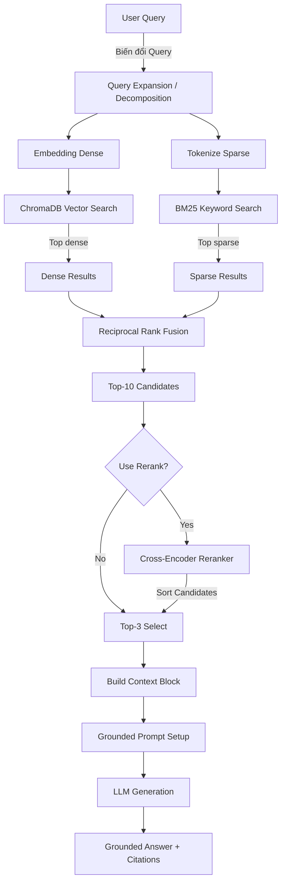

# Architecture — RAG Pipeline (Day 08 Lab)

> Template: Điền vào các mục này khi hoàn thành từng sprint.
> Deliverable của Documentation Owner.

## 1. Tổng quan kiến trúc

```
[Raw Docs]
    ↓
[index.py: Preprocess → Chunk → Embed → Store]
    ↓
[ChromaDB Vector Store]
    ↓
[rag_answer.py: Query → Retrieve → Rerank → Generate]
    ↓
[Grounded Answer + Citation]
```

**Mô tả ngắn gọn:**
Hệ thống là một trợ lý nội bộ phục vụ cho khối Customer Support và IT Helpdesk. Nó có khả năng tự động truy xuất và trả lời các câu hỏi về chính sách nội bộ, thời gian xử lý sự cố, cũng như các quy trình cấp quyền. Điều này giúp tối ưu hoá thời gian giải đáp và tra cứu thông tin cho nhân viên, đi kèm với nguồn chứng cứ cụ thể chống lại việc LLM bịa đặt thông tin.

---

## 2. Indexing Pipeline (Sprint 1)

### Tài liệu được index
| File | Nguồn | Department | Số chunk |
|------|-------|-----------|---------|
| `policy_refund_v4.txt` | policy/refund-v4.pdf | CS | Tự động phân tách |
| `sla_p1_2026.txt` | support/sla-p1-2026.pdf | IT | Tự động phân tách |
| `access_control_sop.txt` | it/access-control-sop.md | IT Security | Tự động phân tách |
| `it_helpdesk_faq.txt` | support/helpdesk-faq.md | IT | Tự động phân tách |
| `hr_leave_policy.txt` | hr/leave-policy-2026.pdf | HR | Tự động phân tách |

### Quyết định chunking
| Tham số | Giá trị | Lý do |
|---------|---------|-------|
| Chunk size | 400 ký tự | Phù hợp để LLM có thể đọc dễ dàng làm Context mà không chứa quá nhiều thông tin gây nhiễu. |
| Overlap | 80 ký tự | Đảm bảo context liên kết chặt chẽ và không bị đứt đoạn thuật ngữ giữa các chunk liền kề. |
| Chunking strategy | Heading-based, Section-based và Regex | Chia văn bản theo từng tiêu đề phần mục lớn (Section) bằng regex `===.*?===`, sau đó ngắt thành doạn nhỏ ở từng khoảng trắng hoặc theo dấu `?` trong FAQ, để tránh vỡ cấu trúc và nội dung câu hỏi. |
| Metadata fields | source, section, effective_date, department, access | Phục vụ filter, freshness, citation |

### Embedding model
- **Model**: OpenAI `text-embedding-3-small`
- **Vector store**: ChromaDB (PersistentClient)
- **Similarity metric**: Cosine

---

## 3. Retrieval Pipeline (Sprint 2 + 3)

### Baseline (Sprint 2)
| Tham số | Giá trị |
|---------|---------|
| Strategy | Dense (embedding similarity) |
| Top-k search | 10 |
| Top-k select | 3 |
| Rerank | Không |

### Variant (Sprint 3)
| Tham số | Giá trị | Thay đổi so với baseline |
|---------|---------|------------------------|
| Strategy | Hybrid (Dense + Sparse) | Sử dụng Reciprocal Rank Fusion kết hợp giữa Semantic Similarity và Keyword Search BM25. |
| Top-k search | 10 | Lấy số lượng 10 ứng viên (giữ nguyên config từ Baseline) |
| Top-k select | 3 | Lọc ra 3 tài liệu sát nhất trước khi feed vào trong prompt. |
| Rerank | Cross-Encoder (`ms-marco-MiniLM-L-6-v2`) | Thêm bước Rerank lên top 10 chunk trả về để tăng cường độ điểm số Relevancy. |
| Query transform | Hỗ trợ Expansion/Decomposition | Mở rộng keyword, tên đồng nghĩa (như 'P1', 'hoàn tiền') hoặc tách cấu trúc query phức tạp. |

**Lý do chọn variant này:**
Giải pháp Variant Hybrid cùng với Cross-encoder (Reranker) được lựa chọn bởi vì trong cơ sở dữ liệu có các quy tắc, các đoạn mã lỗi, mã số vé (ví dụ như ERR-403-AUTH hoặc ticket P1) rất khó có thể tìm ra nếu chỉ đánh giá bằng sự tương đồng ngữ nghĩa (Dense Semantic). Việc kết hợp BM25 Sparse Search giúp nắm bắt các exact keyword tốt hơn nhiều. Hơn nữa, Reranker là điều cốt lõi bù trừ điểm yếu vì kết hợp 2 cách tra cứu này tạo ra nhiều văn bản ít liên quan lọt top (Noise), reranker sẽ có sức mạnh sắp xếp lại chính xác từng đoạn văn nào thực sự chứa đáp án.

---

## 4. Generation (Sprint 2)

### Grounded Prompt Template
```
Answer only from the retrieved context below.
If the context is insufficient, say you do not know.
Cite the source field when possible.
Keep your answer short, clear, and factual.

Question: {query}

Context:
[1] {source} | {section} | score={score}
{chunk_text}

[2] ...

Answer:
```

### LLM Configuration
| Tham số | Giá trị |
|---------|---------|
| Model | `gpt-4o-mini` (Có fallback sẵn về `gemini-2.5-flash` nếu không có key) |
| Temperature | 0 (để output ổn định và có tính determinism cao cho eval) |
| Max tokens | 512 |

---

## 5. Failure Mode Checklist

> Dùng khi debug — kiểm tra lần lượt: index → retrieval → generation

| Failure Mode | Triệu chứng | Cách kiểm tra |
|-------------|-------------|---------------|
| Index lỗi | Retrieve về docs cũ / sai version | `inspect_metadata_coverage()` trong index.py |
| Chunking tệ | Chunk cắt giữa điều khoản | `list_chunks()` và đọc text preview |
| Retrieval lỗi | Không tìm được expected source | `score_context_recall()` trong eval.py |
| Generation lỗi | Answer không grounded / bịa | `score_faithfulness()` trong eval.py |
| Token overload | Context quá dài → lost in the middle | Kiểm tra độ dài context_block |

---

## 6. Diagram

Mô hình hoạt động của Pipeline Variant:


