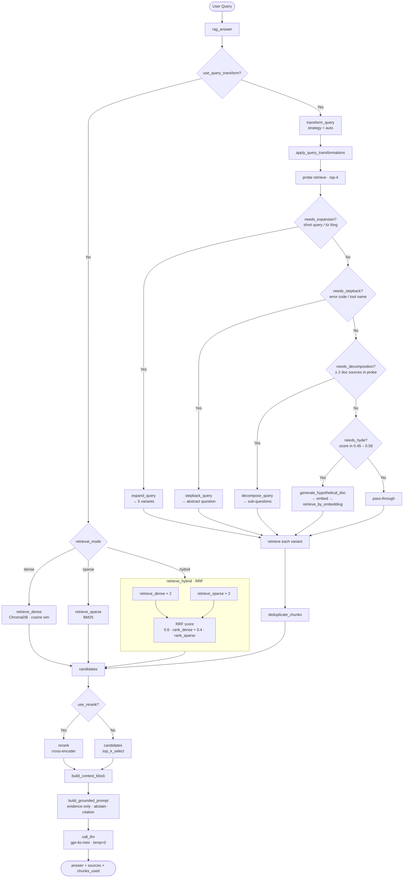

# Architecture — RAG Pipeline (Day 08 Lab)

> Template: Điền vào các mục này khi hoàn thành từng sprint.
> Deliverable của Documentation Owner.

## 1. Tổng quan kiến trúc

```
[Raw Docs]
    ↓
[index.py: Preprocess → Chunk → Embed → Store]
    ↓
[ChromaDB Vector Store]
    ↓
[rag_answer.py: Query → Retrieve → Rerank → Generate]
    ↓
[Grounded Answer + Citation]
```

**Mô tả ngắn gọn:**

> Nhóm xây một chatbot RAG để trả lời câu hỏi từ tài liệu nội bộ kèm citation. Hệ thống giúp người dùng tìm thông tin nhanh, chính xác và đáng tin cậy.

---

## 2. Indexing Pipeline (Sprint 1)

### Tài liệu được index

| File                     | Nguồn                    | Department  | Số chunk |
| ------------------------ | ------------------------ | ----------- | -------- |
| `policy_refund_v4.txt`   | policy/refund-v4.pdf     | CS          | 6        |
| `sla_p1_2026.txt`        | support/sla-p1-2026.pdf  | IT          | 6        |
| `access_control_sop.txt` | it/access-control-sop.md | IT Security | 7        |
| `it_helpdesk_faq.txt`    | support/helpdesk-faq.md  | IT          | 12       |
| `hr_leave_policy.txt`    | hr/leave-policy-2026.pdf | HR          | 5        |

### Quyết định chunking

| Tham số           | Giá trị                                                                                                        | Lý do                                                                                |
| ----------------- | -------------------------------------------------------------------------------------------------------------- | ------------------------------------------------------------------------------------ |
| Chunk size        | 400 tokens                                                                                                     | Common practice                                                                      |
| Overlap           | 80 tokens                                                                                                      | Preserve context                                                                     |
| Chunking strategy | Mỗi file chunking 1 kiểu khác nhau (chi tiết trong README)                                                     | Mỗi tài liệu có 1 kiểu bố trí dữ liệu khác nhau và sẽ có cách chunk tối ưu khác nhau |
| Metadata fields   | doc_id, chunk_id, section_title, department, effective_date, prev_chunk_id, next_chunk_id, aliases, char_count | Phục vụ filter, freshness, citation                                                  |

### Embedding model

- **Model**: OpenAI text-embedding-3-small
- **Vector store**: ChromaDB (PersistentClient)
- **Similarity metric**: Cosine

---

## 3. Retrieval Pipeline (Sprint 2 + 3)

### Baseline (Sprint 2)

| Tham số      | Giá trị                      |
| ------------ | ---------------------------- |
| Strategy     | Dense (embedding similarity) |
| Top-k search | 10                           |
| Top-k select | 3                            |
| Rerank       | Không                        |

### Variant (Sprint 3)

| Tham số         | Giá trị       | Thay đổi so với baseline |
| --------------- | ------------- | ------------------------ |
| Strategy        | hybrid        | Có                       |
| Top-k search    | 10            | Không                    |
| Top-k select    | 3             | Không                    |
| Rerank          | Không         | Không                    |
| Query transform | decomposition | Có                       |

**Lý do chọn variant này:**

> Chọn hybrid retrieval vì corpus chứa cả văn bản tự nhiên lẫn từ khóa/ thuật ngữ đặc thù, giúp kết hợp ưu điểm của semantic và keyword matching để tăng recall. Áp dụng query decomposition để tách câu hỏi phức tạp thành các truy vấn nhỏ, cải thiện độ chính xác khi retrieve thông tin liên quan, đặc biệt khi cần truy vấn từ nhiều hơn 2 file khác nhau.

---

## 4. Generation (Sprint 2)

### Grounded Prompt Template

```
Answer only from the retrieved context below.
If the context is insufficient to answer the question, say you do not know and do not make up information, suggest user to contact support.
Cite the source field (in brackets like [1]) when possible.
Keep your answer short, clear, and factual.
Respond in the same language as the question.

Question: {query}

Context:
{context_block}

Answer:
```

### LLM Configuration

| Tham số     | Giá trị                        |
| ----------- | ------------------------------ |
| Model       | gpt-4o-mini                    |
| Temperature | 0 (để output ổn định cho eval) |
| Max tokens  | 512                            |

---

## 5. Failure Mode Checklist

> Dùng khi debug — kiểm tra lần lượt: index → retrieval → generation

| Failure Mode   | Triệu chứng                          | Cách kiểm tra                                |
| -------------- | ------------------------------------ | -------------------------------------------- |
| Index lỗi      | Retrieve về docs cũ / sai version    | `inspect_metadata_coverage()` trong index.py |
| Chunking tệ    | Chunk cắt giữa điều khoản            | `list_chunks()` và đọc text preview          |
| Retrieval lỗi  | Không tìm được expected source       | `score_context_recall()` trong eval.py       |
| Generation lỗi | Answer không grounded / bịa          | `score_faithfulness()` trong eval.py         |
| Token overload | Context quá dài → lost in the middle | Kiểm tra độ dài context_block                |

---

## 6. Diagram (tùy chọn)

> Sơ đồ pipeline (mermaid)


