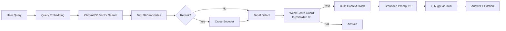

# Architecture — RAG Pipeline (Day 08 Lab)

## 1. Tổng quan kiến trúc

```
[Raw Docs (5 files)]
    ↓
[index.py: Preprocess → Chunk → Embed → Store]
    ↓
[ChromaDB Vector Store (29 chunks)]
    ↓
[rag_answer.py: Query → Retrieve top-20 → Select top-8 → Grounded Prompt → LLM]
    ↓
[Answer + Citation [n] + Abstain guard]
```

Pipeline RAG trả lời câu hỏi nội bộ về chính sách hoàn tiền, SLA P1, Access Control, FAQ IT và HR — chỉ dựa trên 5 file trong `data/docs/`. Vector store cục bộ (ChromaDB) + LLM grounded có trích dẫn `[n]`.

---

## 2. Indexing Pipeline (Sprint 1)

### Tài liệu được index

| File | Nguồn | Department | Số chunk |
|------|-------|-----------|:-------:|
| `policy_refund_v4.txt` | policy/refund-v4.pdf | CS | 6 |
| `sla_p1_2026.txt` | support/sla-p1-2026.pdf | IT | 5 |
| `access_control_sop.txt` | it/access-control-sop.md | IT Security | 7 |
| `it_helpdesk_faq.txt` | support/helpdesk-faq.md | IT | 6 |
| `hr_leave_policy.txt` | hr/leave-policy-2026.pdf | HR | 5 |

**Tổng:** 29 chunk (sau `python index.py build`).

### Quyết định chunking

| Tham số | Giá trị | Lý do |
|---------|---------|-------|
| Chunk size | ~400 tokens (~1600 ký tự) | Cân bằng ngữ cảnh vs độ dài prompt |
| Overlap | ~80 tokens (~320 ký tự) | Giữ liền mạch giữa các chunk kế cận |
| Chunking strategy | Theo heading `=== ... ===`, gom đoạn + cắt mềm tại ranh giới câu | Tránh cắt giữa điều khoản |
| Metadata fields | source, section, effective_date, department, access | Citation, freshness, filter |

### Embedding model
- **Model:** OpenAI `text-embedding-3-small` (mặc định) hoặc `paraphrase-multilingual-MiniLM-L12-v2` (local)
- **Vector store**: ChromaDB (`PersistentClient`, collection `rag_lab`)
- **Similarity metric**: Cosine (`hnsw:space: cosine`)

---

## 3. Retrieval Pipeline (Sprint 2 + 3)

### Baseline (Sprint 2)

| Tham số | Giá trị |
|---------|---------|
| Strategy | Dense (embedding similarity) |
| Top-k search | 10 |
| Top-k select | 3 |
| Rerank | Không |
| Weak context threshold | 0.15 |

### Variant — Production config (Sprint 3, sau tối ưu)

| Tham số | Giá trị | Thay đổi so với baseline |
|---------|---------|------------------------|
| Strategy | Dense | Giữ nguyên |
| Top-k search | **20** | Tìm rộng hơn, pool lớn hơn |
| Top-k select | **8** | Cho LLM xem 8 chunk thay vì 3 |
| Rerank | Không | Giữ nguyên |
| Weak context threshold | **0.05** | Giảm false abstain |
| Prompt | **v2 (9 rules)** | Thêm scope, per-fact citation, actionable details |

**Lý do chọn variant này:**
Phân tích baseline cho thấy root cause của hầu hết failure (gq05 Zero, gq09 Partial) là thiếu chunk trong context. Tăng `top_k_select` từ 3→8 giúp LLM nhìn thấy cả section scope lẫn section detail, đặc biệt cần cho câu multi-section và cross-document. Threshold giảm từ 0.15→0.05 tránh chặn nhầm chunk hợp lệ nhưng có cosine score thấp (ví dụ: "contractor" vs "Admin Access Level 4").

**Kết quả A/B:** Variant +14 raw points (69→83/98), cải thiện mọi metric. Chi tiết: `docs/tuning-log.md`.

### Hybrid retrieval (Sprint 3 — đã implement)
- Dense + BM25 (RRF k=60): đã implement trong `retrieve_hybrid()`.
- Rerank cross-encoder `ms-marco-MiniLM-L-6-v2`: đã implement trong `rerank_cross_encoder()`.
- Kết quả A/B dense-vs-hybrid: hybrid thua về Relevance (4.2 vs 3.8) do BM25 noise. Chi tiết trong tuning-log.
- Hybrid vẫn có lợi thế cho câu alias/keyword (ví dụ: "Approval Matrix" → Access Control SOP).

---

## 4. Generation (Sprint 2)

### Grounded Prompt Template (v2)

```
--- Snippet [1] from: {source} § {section} ---
{chunk_text}

--- Snippet [2] from: {source} § {section} ---
{chunk_text}
...
```

Prompt rules (v2, 9 rules):
1. Only use context snippets
2. Never invent specifics
3. Stay focused but complete
4. Scope + applicability awareness
5. Abstain only when genuinely no relevant fact
6. Per-fact citation with specific snippet numbers
7. Include actionable details (URLs, ext., hotlines)
8. Source-naming citation
9. Same language as question

### LLM Configuration

| Tham số | Giá trị |
|---------|---------|
| Model | `gpt-4o-mini` |
| Temperature | 0 |
| Max tokens | 512 |

---

## 5. Failure Mode Checklist

| Failure Mode | Triệu chứng | Cách kiểm tra |
|-------------|-------------|---------------|
| Index lỗi | Retrieve docs cũ / sai version | `inspect_metadata_coverage()` |
| Chunking tệ | Chunk cắt giữa điều khoản | `list_chunks()` |
| Retrieval thiếu | Không tìm đủ expected source | `score_context_recall()` |
| Generation bịa | Answer không grounded | `score_faithfulness()` |
| False abstain | Pipeline từ chối dù có info | Kiểm tra threshold + chunk scores |
| Token overload | Context quá dài → lost in the middle | Kiểm tra `len(context_block)` |

---

## 6. Diagram


