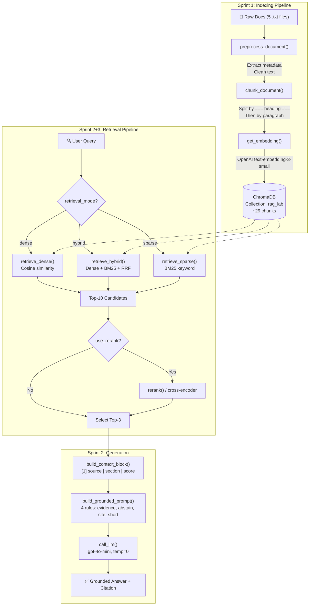
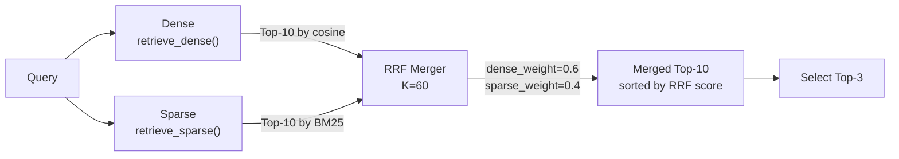

# Architecture — RAG Pipeline (Day 08 Lab)

> Template: Điền vào các mục này khi hoàn thành từng sprint.
> Deliverable của Documentation Owner.

## 1. Tổng quan kiến trúc

```
[Raw Docs]  (5 file .txt: policy, SLA, access control, helpdesk FAQ, HR leave)
     ↓
[index.py: Preprocess → Chunk → Embed → Store]
     ↓  preprocess_document() → chunk_document() → get_embedding() → ChromaDB upsert
[ChromaDB Vector Store]  (PersistentClient, cosine similarity)
     ↓
[rag_answer.py: Query → Retrieve → Rerank → Generate]
     ↓  retrieve_dense() / retrieve_hybrid() → build_context_block() → call_llm()
[Grounded Answer + Citation]
```

**Mô tả ngắn gọn:**
> Hệ thống là một **trợ lý nội bộ cho khối CS + IT Helpdesk**, sử dụng kiến trúc RAG (Retrieval-Augmented Generation) để trả lời câu hỏi về chính sách hoàn tiền, SLA ticket, quy trình cấp quyền, và FAQ kỹ thuật. Hệ thống đọc 5 tài liệu nội bộ, chia chunk theo section heading, embed bằng OpenAI, lưu vào ChromaDB, và khi nhận câu hỏi sẽ retrieve context liên quan rồi gọi LLM sinh câu trả lời có citation. Pipeline hỗ trợ cả dense retrieval (baseline) và hybrid retrieval (dense + BM25 sparse kết hợp bằng RRF).

---

## 2. Indexing Pipeline (Sprint 1)

### Data Flow chi tiết

```
  ┌─────────────────────────────────────────────────────────────────┐
  │  1. ĐỌC FILE                                                    │
  │  filepath.read_text(encoding="utf-8")                            │
  │  → raw_text (toàn bộ nội dung .txt)                              │
  └──────────────────────────┬──────────────────────────────────────┘
                             ↓
  ┌─────────────────────────────────────────────────────────────────┐
  │  2. PREPROCESS — preprocess_document(raw_text, filepath)        │
  │  • Parse header metadata: Source, Department, Effective Date,    │
  │    Access từ các dòng "Key: Value" ở đầu file                    │
  │  • Tách header khỏi nội dung (dừng khi gặp "===")               │
  │  • Normalize: bỏ dòng trống thừa (max 2 dòng trống liên tiếp)   │
  │  → output: { "text": cleaned_text, "metadata": {...} }          │
  └──────────────────────────┬──────────────────────────────────────┘
                             ↓
  ┌─────────────────────────────────────────────────────────────────┐
  │  3. CHUNK — chunk_document(doc)                                  │
  │  Bước 3a: Split theo heading "=== Section ... ==="               │
  │     → Mỗi section = 1 phần nội dung riêng                       │
  │  Bước 3b: Nếu section > CHUNK_SIZE * 4 ký tự (1600 chars)       │
  │     → Split tiếp theo paragraph (\n\n) với overlap               │
  │     → Paragraph-based: ghép paragraph đến gần đủ chunk_chars,    │
  │       giữ paragraph cuối làm overlap cho chunk tiếp theo         │
  │  Bước 3c: Fallback character-based nếu chỉ có 1 paragraph dài   │
  │     → Tìm ranh giới tự nhiên: \n\n > \n > ". "                   │
  │  Mỗi chunk giữ đầy đủ metadata gốc + section name               │
  │  → output: List[{ "text": chunk_text, "metadata": {...} }]      │
  └──────────────────────────┬──────────────────────────────────────┘
                             ↓
  ┌─────────────────────────────────────────────────────────────────┐
  │  4. EMBED + STORE — get_embedding() + ChromaDB upsert            │
  │  • Gọi OpenAI text-embedding-3-small cho mỗi chunk              │
  │  • Upsert vào ChromaDB với id = "{filename}_{index}"             │
  │    ids, embeddings, documents, metadatas                         │
  │  → ChromaDB collection "rag_lab" (cosine similarity)             │
  └─────────────────────────────────────────────────────────────────┘
```

### Tài liệu được index
| File | Nguồn | Department | Số chunk (ước tính) |
|------|-------|-----------|---------:|
| `policy_refund_v4.txt` | policy/refund-v4.pdf | CS | ~6 |
| `sla_p1_2026.txt` | support/sla-p1-2026.pdf | IT | ~5 |
| `access_control_sop.txt` | it/access-control-sop.md | IT Security | ~7 |
| `it_helpdesk_faq.txt` | support/helpdesk-faq.md | IT | ~6 |
| `hr_leave_policy.txt` | hr/leave-policy-2026.pdf | HR | ~5 |

> **Tổng**: ~29 chunks từ 5 tài liệu.

### Quyết định chunking
| Tham số | Giá trị | Lý do |
|---------|---------|-------|
| Chunk size | 400 tokens (~1600 ký tự) | Slide gợi ý 300-500 tokens. Chọn 400 để cân bằng giữa đủ context cho LLM và không quá dài gây nhiễu |
| Overlap | 80 tokens (~320 ký tự) | Slide gợi ý 50-80 tokens. Chọn 80 để giữ ngữ cảnh tối đa tại ranh giới chunk, tránh mất thông tin liên tiếp |
| Chunking strategy | **Heading-based (primary) + Paragraph-based (secondary)** | Ưu tiên cắt theo `=== Section ===` (ranh giới tự nhiên của tài liệu). Nếu section quá dài thì split tiếp theo paragraph `\n\n`. Fallback character-based khi chỉ có 1 paragraph dài |
| Boundary detection | Paragraph (`\n\n`) → Newline (`\n`) → Sentence (`. `) | Tìm ranh giới tự nhiên gần nhất thay vì cắt giữa câu — tránh chunk bị cắt giữa điều khoản |
| Metadata fields | source, section, effective_date, department, access | **source**: để citation. **section**: để biết chunk thuộc phần nào. **effective_date**: để filter freshness. **department**: phân loại theo bộ phận. **access**: kiểm soát quyền truy cập |

### Embedding model
- **Model**: OpenAI `text-embedding-3-small` (Option A — API-based, 1536 dimensions)
- **Vector store**: ChromaDB (PersistentClient, lưu tại `./chroma_db/`)
- **Similarity metric**: Cosine (config `hnsw:space = "cosine"`)
- **Collection name**: `rag_lab`

---

## 3. Retrieval Pipeline (Sprint 2 + 3)

### Baseline (Sprint 2) — Dense Retrieval
| Tham số | Giá trị |
|---------|---------|
| Strategy | Dense (embedding similarity via ChromaDB `.query()`) |
| Top-k search | 10 (search rộng) |
| Top-k select | 3 (chọn 3 chunk tốt nhất đưa vào prompt) |
| Rerank | Không |
| Score | `1 - distance` (ChromaDB cosine distance → similarity) |

**Cách hoạt động `retrieve_dense()`:**
1. Embed câu hỏi bằng cùng model `text-embedding-3-small`
2. Query ChromaDB với `query_embeddings`, lấy `n_results=10`
3. Chuyển `distance` → `score = 1 - distance` (cosine similarity)
4. Trả về top-10 chunks kèm text, metadata, score

### Variant (Sprint 3) — Hybrid Retrieval (Dense + Sparse/BM25)
| Tham số | Giá trị | Thay đổi so với baseline |
|---------|---------|------------------------|
| Strategy | **Hybrid** (Dense + Sparse kết hợp RRF) | Thêm BM25 sparse search |
| Top-k search | 10 | Giữ nguyên |
| Top-k select | 3 | Giữ nguyên |
| Rerank | Không thực sự hoạt động (hàm `rerank()` chỉ trả `candidates[:top_k]`) | Config ghi `use_rerank=True` nhưng rerank chưa implement cross-encoder |
| Query transform | Không sử dụng | N/A |
| Fusion method | **Reciprocal Rank Fusion (RRF)** với K=60 | Dense weight 0.6, Sparse weight 0.4 |

**Cách hoạt động `retrieve_sparse()` (BM25):**
1. Load toàn bộ documents từ ChromaDB
2. Tokenize corpus: `doc.lower().split()` (whitespace tokenization)
3. Build BM25 index bằng `BM25Okapi` từ `rank_bm25`
4. Tính score cho query đã tokenize
5. Trả về top-k theo BM25 score giảm dần

**Cách hoạt động `retrieve_hybrid()` (RRF Fusion):**
1. Gọi `retrieve_dense()` → top-10 dense results
2. Gọi `retrieve_sparse()` → top-10 sparse results
3. Tính RRF score cho mỗi chunk:
   - Dense: `rrf += dense_weight × 1/(K + rank)` (K=60)
   - Sparse: `rrf += sparse_weight × 1/(K + rank)`
4. Chunks xuất hiện ở cả 2 danh sách → RRF score cộng dồn → xếp hạng cao hơn
5. Sort theo RRF giảm dần, lấy top-k

**Lý do chọn variant hybrid:**
> Chọn hybrid vì corpus có cả nội dung ngôn ngữ tự nhiên (policy mô tả quy trình) lẫn keyword/mã chuyên ngành (SLA ticket P1, Level 3, ERR-403). Dense retrieval mạnh ở paraphrase matching nhưng yếu ở exact keyword. BM25 bổ trợ bằng khả năng match chính xác term. Cụ thể, câu q07 ("Approval Matrix") dùng alias/tên cũ của tài liệu mà dense có thể bỏ lỡ vì embedding không nắm bắt được quan hệ alias. BM25 có thể match keyword "Approval Matrix" trực tiếp trong text.

---

## 4. Generation (Sprint 2)

### Grounded Prompt Template
```
You are a precise helpdesk assistant. Follow these rules strictly:

1. Answer ONLY using information explicitly stated in the retrieved context below.
2. If the context does NOT contain a direct answer to the question, respond exactly:
   "Không đủ dữ liệu để trả lời câu hỏi này."
3. Do NOT guess, infer, or use your own knowledge. If the specific term, code, or
   concept in the question is not mentioned in the context, you must abstain.
4. Cite sources using bracket notation like [1], [2] matching the context numbers.
5. Keep your answer short, clear, and factual.
6. Respond in the same language as the question.

Question: {query}

Context:
[1] {source} | {section} | score={score}
{chunk_text}

[2] ...

Answer:
```

**Đặc điểm prompt (4 quy tắc từ slide):**
1. **Evidence-only**: "Answer ONLY using information explicitly stated in the retrieved context"
2. **Abstain**: "If the context does NOT contain a direct answer... respond exactly: Không đủ dữ liệu"
3. **Citation**: "Cite sources using bracket notation like [1], [2]"
4. **Short, clear, stable**: "Keep your answer short, clear, and factual"

### LLM Configuration
| Tham số | Giá trị |
|---------|---------|
| Model | `gpt-4o-mini` (OpenAI, config từ env `LLM_MODEL`) |
| Temperature | 0 (để output ổn định, deterministic cho evaluation) |
| Max tokens | 512 |
| API | OpenAI Chat Completions (`client.chat.completions.create()`) |

---

## 5. Failure Mode Checklist

> Dùng khi debug — kiểm tra lần lượt: index → retrieval → generation

| Failure Mode | Triệu chứng | Cách kiểm tra |
|-------------|-------------|---------------|
| Index lỗi | Retrieve về docs cũ / sai version | `inspect_metadata_coverage()` trong index.py |
| Chunking tệ | Chunk cắt giữa điều khoản | `list_chunks()` và đọc text preview |
| Retrieval lỗi | Không tìm được expected source | `score_context_recall()` trong eval.py |
| Generation lỗi | Answer không grounded / bịa | `score_faithfulness()` trong eval.py |
| Token overload | Context quá dài → lost in the middle | Kiểm tra độ dài context_block |
| **Dependency lỗi** | **Module `rank_bm25` chưa cài → hybrid crash toàn bộ** | **`pip install rank-bm25` và chạy lại** |
| Rerank chưa implement | `use_rerank=True` nhưng hàm chỉ trả `candidates[:top_k]` | Kiểm tra `rerank()` trong rag_answer.py |

---

## 6. Diagram

### Pipeline tổng thể (Indexing + Retrieval + Generation)



### Hybrid Retrieval Flow (Sprint 3)


