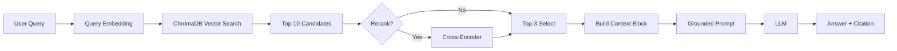

# Architecture — RAG Pipeline (Day 08 Lab)

> Template: Điền vào các mục này khi hoàn thành từng sprint.
> Deliverable của Documentation Owner.

## 1. Tổng quan kiến trúc

```
[Raw Docs]
    ↓
[index.py: Preprocess → Chunk → Embed → Store]
    ↓
[ChromaDB Vector Store]
    ↓
[rag_answer.py: Query → Retrieve → Rerank → Generate]
    ↓
[Grounded Answer + Citation]
```

**Mô tả ngắn gọn:**
> Pipeline RAG trả lời câu hỏi nội bộ về chính sách hoàn tiền, SLA P1, Access Control, FAQ IT và HR — chỉ dựa trên 5 file trong `data/docs/`. Người dùng: CS/IT Helpdesk. Vector store cục bộ (ChromaDB) + LLM grounded có trích dẫn `[n]`.

---

## 2. Indexing Pipeline (Sprint 1)

### Tài liệu được index
| File | Nguồn | Department | Số chunk |
|------|-------|-----------|---------|
| `policy_refund_v4.txt` | policy/refund-v4.pdf | CS | 6 |
| `sla_p1_2026.txt` | support/sla-p1-2026.pdf | IT | 5 |
| `access_control_sop.txt` | it/access-control-sop.md | IT Security | 7 |
| `it_helpdesk_faq.txt` | support/helpdesk-faq.md | IT | 6 |
| `hr_leave_policy.txt` | hr/leave-policy-2026.pdf | HR | 5 |

**Tổng:** 29 chunk (sau `python index.py build`).

### Quyết định chunking
| Tham số | Giá trị | Lý do |
|---------|---------|-------|
| Chunk size | ~400 tokens (~1600 ký tự) | Cân bằng ngữ cảnh vs độ dài prompt |
| Overlap | ~80 tokens (~320 ký tự) | Giữ liền mạch giữa các chunk kế cận |
| Chunking strategy | Theo heading `=== ... ===`, sau đó gom đoạn văn + cắt mềm tại ranh giới câu/đoạn | Tránh cắt giữa điều khoản |
| Metadata fields | source, section, effective_date, department, access | Citation, freshness, filter |

### Embedding model
- **Model (mặc định):** OpenAI `text-embedding-3-small` khi `EMBEDDING_PROVIDER=openai`
- **Local:** `paraphrase-multilingual-MiniLM-L12-v2` khi `EMBEDDING_PROVIDER=local` (khớp với lúc build index)
- **Vector store**: ChromaDB (`PersistentClient`, collection `rag_lab`)
- **Similarity metric**: Cosine (`hnsw:space: cosine`)

---

## 3. Retrieval Pipeline (Sprint 2 + 3)

### Baseline (Sprint 2)
| Tham số | Giá trị |
|---------|---------|
| Strategy | Dense (embedding similarity) |
| Top-k search | 10 |
| Top-k select | 3 |
| Rerank | Không |

### Variant (Sprint 3)
| Tham số | Giá trị | Thay đổi so với baseline |
|---------|---------|------------------------|
| Strategy | Hybrid (dense + BM25, RRF k=60) | + sparse + rank fusion |
| Top-k search | 10 | Giữ như baseline |
| Top-k select | 3 | Giữ như baseline |
| Rerank | Có — `cross-encoder/ms-marco-MiniLM-L-6-v2` | Lọc nhiễu trước khi đưa vào LLM |
| Query transform | Không (mặc định) | Có thể bật sau nếu cần alias |

**Lý do chọn variant này:**
> Hybrid RRF giúp vừa bắt từ khóa (P1, ERR-403, Flash Sale) vừa giữ ngữ nghĩa (alias như “Approval Matrix” → Access Control SOP). Rerank cross-encoder chọn top-3 chunk sát câu hỏi nhất sau khi search rộng.

### Giai thich ngan gon: vi sao tuning tot hon baseline
- Baseline chi dung dense retrieval nen de bo sot cac cau co tu khoa dac thu (vi du ma loi hoac ten chinh sach viet tat).
- Variant hybrid + rerank tim rong hon (dense + BM25), sau do loc lai top chunk sat cau hoi nhat truoc khi gui vao LLM.
- Ket qua thuc te: cau tra loi on dinh hon, giam boi canh nhieu, va citation de kiem chung hon.
- Ket luan de bao cao: tuning khong "lam model thong minh hon", ma giup dua dung ngu canh vao model nen chat luong cau tra loi tang len.

---

## 4. Generation (Sprint 2)

### Grounded Prompt Template
```
Answer only from the retrieved context below.
If the context is insufficient, say you do not know.
Cite the source field when possible.
Keep your answer short, clear, and factual.

Question: {query}

Context:
[1] {source} | {section} | score={score}
{chunk_text}

[2] ...

Answer:
```

### LLM Configuration
| Tham số | Giá trị |
|---------|---------|
| Model | `gpt-4o-mini` (hoặc Gemini nếu `LLM_PROVIDER=gemini`) |
| Temperature | 0 (để output ổn định cho eval) |
| Max tokens | 512 |

---

## 5. Failure Mode Checklist

> Dùng khi debug — kiểm tra lần lượt: index → retrieval → generation

| Failure Mode | Triệu chứng | Cách kiểm tra |
|-------------|-------------|---------------|
| Index lỗi | Retrieve về docs cũ / sai version | `inspect_metadata_coverage()` trong index.py |
| Chunking tệ | Chunk cắt giữa điều khoản | `list_chunks()` và đọc text preview |
| Retrieval lỗi | Không tìm được expected source | `score_context_recall()` trong eval.py |
| Generation lỗi | Answer không grounded / bịa | `score_faithfulness()` trong eval.py |
| Token overload | Context quá dài → lost in the middle | Kiểm tra độ dài context_block |

---

## 6. Diagram


