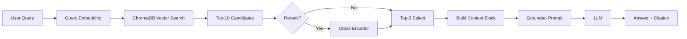

# Architecture — RAG Pipeline (Day 08 Lab)

> Template: Điền vào các mục này khi hoàn thành từng sprint.
> Deliverable của Documentation Owner.

## 1. Tổng quan kiến trúc

```
[Raw Docs]
    ↓
[index.py: Preprocess → Chunk → Embed → Store]
    ↓
[ChromaDB Vector Store]
    ↓
[rag_answer.py: Query → Retrieve → Rerank → Generate]
    ↓
[Grounded Answer + Citation]
```

**Mô tả ngắn gọn:**
> TODO: Mô tả hệ thống trong 2-3 câu. Nhóm xây gì? Cho ai dùng? Giải quyết vấn đề gì?

---
## 2. Indexing Pipeline (Sprint 1)

### Tài liệu được index
| File | Nguồn | Department | Số chunk |
|------|-------|-----------|---------|
| `policy_refund_v4.txt` | policy/refund-v4.pdf | CS | 6 |
| `sla_p1_2026.txt` | support/sla-p1-2026.pdf | IT | 5 |
| `access_control_sop.txt` | it/access-control-sop.md | IT Security | 7 |
| `it_helpdesk_faq.txt` | support/helpdesk-faq.md | IT | 6 |
| `hr_leave_policy.txt` | hr/leave-policy-2026.pdf | HR | 5 |

### Quyết định chunking
| Tham số | Giá trị | Lý do |
| --- | --- | --- |
| Chunk size | 400 | Kích thước 400 token đủ nhỏ để đảm bảo độ chính xác khi truy vấn, nhưng vẫn đủ lớn để giữ ngữ cảnh liền mạch. |
| Overlap | 80 | Đặt overlap 80 token giúp tránh mất thông tin ở ranh giới giữa các chunk, đảm bảo câu hoặc đoạn không bị cắt rời. |
| Chunking strategy | paragraph-based | Chiến lược theo đoạn văn giữ nguyên cấu trúc logic và ngữ nghĩa, phù hợp với tài liệu có bố cục rõ ràng. |
| Metadata fields | source, section, effective_date, department, access | Các trường metadata này hỗ trợ lọc, đảm bảo tính mới (freshness), và trích dẫn chính xác nguồn gốc thông tin. |

### Embedding model
- **Model**: text-embedding-3-small (OpenAI) - Giúp vector hóa ngôn ngữ tự nhiên tốt và tiết kiệm chi phí.
- **Vector store**: ChromaDB (PersistentClient)
- **Similarity metric**: Cosine

---

## 3. Retrieval Pipeline (Sprint 2 + 3)

### Baseline (Sprint 2)
| Tham số | Giá trị |
|---------|---------|
| Strategy | Dense (embedding similarity) |
| Top-k search | 10 |
| Top-k select | 3 |
| Rerank | Không |

### Variant (Sprint 3)
| Tham số | Giá trị | Thay đổi so với baseline |
|---------|---------|------------------------|
| Strategy | hybrid | dense |
| Top-k search | 5 | 10 |
| Top-k select | 5 | 3 |
| Rerank | False | False |
| Query transform | None | None |

**Lý do chọn variant này:**
> TODO: Giải thích tại sao chọn biến này để tune.
> Ví dụ: "Chọn hybrid vì corpus có cả câu tự nhiên (policy) lẫn mã lỗi và tên chuyên ngành (SLA ticket P1, ERR-403)."
- Nhóm chọn Hybrid Search (kết hợp Keyword BM25) để đảm bảo các từ khóa quan trọng được khớp chính xác tuyệt đối (Exact Match). Đồng thời, việc tăng top_k_select từ 3 lên 5 giúp LLM có thêm bối cảnh để thực hiện Cross-Document Reasoning (như câu gq02 và gq06 vốn cần thông tin từ nhiều nguồn khác nhau).
---

## 4. Generation (Sprint 2)

### Grounded Prompt Template
```
Answer only from the retrieved context below.
If the context is insufficient, say you do not know.
Cite the source field when possible.
Keep your answer short, clear, and factual.

Question: {query}

Context:
[1] {source} | {section} | score={score}
{chunk_text}

[2] ...

Answer:
```

### LLM Configuration
| Tham số | Giá trị |
|---------|---------|
| Model | gpt-4o-mini |
| Temperature | 0 (để output ổn định cho eval) |
| Max tokens | 512 |

---

## 5. Failure Mode Checklist

> Dùng khi debug — kiểm tra lần lượt: index → retrieval → generation

| Failure Mode | Triệu chứng | Cách kiểm tra |
|-------------|-------------|---------------|
| Index lỗi | Retrieve về docs cũ / sai version | `inspect_metadata_coverage()` trong index.py |
| Chunking tệ | Chunk cắt giữa điều khoản | `list_chunks()` và đọc text preview |
| Retrieval lỗi | Không tìm được expected source | `score_context_recall()` trong eval.py |
| Generation lỗi | Answer không grounded / bịa | `score_faithfulness()` trong eval.py |
| Token overload | Context quá dài → lost in the middle | Kiểm tra độ dài context_block |

---

## 6. Diagram (tùy chọn)

> TODO: Vẽ sơ đồ pipeline nếu có thời gian. Có thể dùng Mermaid hoặc drawio.


