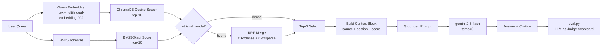

# Architecture — RAG Pipeline (Day 08 Lab)

## 1. Tổng quan kiến trúc

```
[Raw Docs — 5 .txt files]
    ↓
[index.py: Preprocess → Chunk → Embed → Store]
    ↓
[ChromaDB Vector Store — 29 chunks]
    ↓
[rag_answer.py: Query → Retrieve (Dense / BM25 / Hybrid) → Select → Generate]
    ↓
[Grounded Answer + Citation]
    ↓
[eval.py: LLM-as-Judge → Scorecard → A/B Comparison]
```

**Mô tả ngắn gọn:**
Hệ thống RAG cho IT Helpdesk nội bộ, giúp nhân viên tra cứu chính sách công ty (SLA, hoàn tiền, access control, HR).
Pipeline nhận câu hỏi tiếng Việt, tìm kiếm trong 5 tài liệu đã index, và trả lời có trích dẫn nguồn. Mô hình không bịa
thông tin — nếu context không đủ, hệ thống abstain.

---

## 2. Indexing Pipeline (Sprint 1)

### Tài liệu được index

| File                     | Nguồn                    | Department  | Số chunk |
|--------------------------|--------------------------|-------------|----------|
| `hr_leave_policy.txt`    | hr/leave-policy-2026.pdf | HR          | 5        |
| `sla_p1_2026.txt`        | support/sla-p1-2026.pdf  | IT          | 5        |
| `it_helpdesk_faq.txt`    | support/helpdesk-faq.md  | IT          | 6        |
| `access_control_sop.txt` | it/access-control-sop.md | IT Security | 7        |
| `policy_refund_v4.txt`   | policy/refund-v4.pdf     | CS          | 6        |
| **Total**                |                          |             | **29**   |

### Quyết định chunking

| Tham số           | Giá trị                                             | Lý do                                                                                  |
|-------------------|-----------------------------------------------------|----------------------------------------------------------------------------------------|
| Chunk size        | 400 tokens (≈ 1600 chars)                           | Đủ để giữ ngữ cảnh một điều khoản, không quá dài gây lost-in-the-middle                |
| Overlap           | 80 tokens (≈ 320 chars)                             | Tránh cắt giữa câu quan trọng ở ranh giới chunk                                        |
| Chunking strategy | Heading-based (`=== Section ===`)                   | Tài liệu có cấu trúc section rõ ràng — cắt theo heading giữ nguyên ngữ nghĩa từng phần |
| Fallback          | Character-based với overlap                         | Dùng khi section > 1600 chars (không xảy ra trong corpus này)                          |
| Metadata fields   | source, section, effective_date, department, access | Phục vụ citation, freshness filter, và debug                                           |

**Kết quả:** 0 chunks thiếu effective_date, tất cả 29 chunks đều có đủ metadata.

### Embedding model

- **Model**: `text-multilingual-embedding-002` (Vertex AI) — 768-dim
- **Vector store**: ChromaDB `PersistentClient`, collection `"rag_lab"`
- **Similarity metric**: Cosine (`hnsw:space: cosine`)
- **Ghi chú**: Ban đầu dùng OpenAI `text-embedding-3-small` (1536-dim), đổi sang Vertex AI do yêu cầu môi trường.
  ChromaDB lock dimension khi tạo collection — phải xóa `chroma_db/` và rebuild khi đổi model.

---

## 3. Retrieval Pipeline (Sprint 2 + 3)

### Baseline (Sprint 2) — Dense

| Tham số      | Giá trị                             |
|--------------|-------------------------------------|
| Strategy     | Dense (cosine embedding similarity) |
| Top-k search | 10                                  |
| Top-k select | 3                                   |
| Rerank       | Không                               |

### Variant (Sprint 3) — Hybrid (Dense + BM25 via RRF)

| Tham số       | Giá trị               | Thay đổi so với baseline |
|---------------|-----------------------|--------------------------|
| Strategy      | Hybrid (Dense + BM25) | dense → hybrid           |
| dense_weight  | 0.6                   | — (default, chưa tune)   |
| sparse_weight | 0.4                   | — (default, chưa tune)   |
| RRF constant  | 60 (standard)         | —                        |
| Top-k search  | 10                    | Không đổi                |
| Top-k select  | 3                     | Không đổi                |
| Rerank        | Không                 | Không đổi                |

**Lý do chọn variant này:**
Corpus có cả ngôn ngữ tự nhiên (policy, HR) lẫn exact term (P1, ERR-403, Level 3, SLA ticket code). Hybrid giả thuyết sẽ
kết hợp semantic matching của dense với keyword precision của BM25.

**Kết quả thực tế:** Hybrid không cải thiện so với baseline trên corpus tiếng Việt này. BM25 tokenizer naive (
`.lower().split()`) thiếu Vietnamese word segmentation gây nhiễu, đặc biệt với semantic queries như "Approval Matrix" →
abstain sai ở q07.

**Config tốt nhất:** `retrieval_mode="dense"`, `use_rerank=False`

### RRF Formula

```
score(doc) = dense_weight   * 1/(60 + dense_rank)
           + sparse_weight  * 1/(60 + sparse_rank)
```

Rank bắt đầu từ 1 (1-based). Chunk chỉ xuất hiện ở một trong hai list thì sparse/dense score = 0.

---

## 4. Generation (Sprint 2)

### Grounded Prompt Template

```
Answer only from the retrieved context below.
If the context is insufficient to answer the question,
say you do not know and do not make up information.
Cite the source field (in brackets like [1]) when possible.
Keep your answer short, clear, and factual.
Respond in the same language as the question.

Question: {query}

Context:
[1] {source} | {section} | score={score}
{chunk_text}

[2] ...

Answer:
```

### LLM Configuration

| Tham số     | Giá trị                        |
|-------------|--------------------------------|
| Model       | `gemini-2.5-flash` (Vertex AI) |
| Temperature | 0 (output ổn định cho eval)    |
| Max tokens  | 1024                           |

---

## 5. Evaluation (Sprint 4)

### Metrics (LLM-as-Judge, thang 1–5)

| Metric           | Đo lường gì                                 | Baseline | Variant |
|------------------|---------------------------------------------|----------|---------|
| Faithfulness     | Answer có bịa thêm ngoài retrieved context? | 4.60     | 5.00    |
| Answer Relevance | Answer có trả lời đúng câu hỏi?             | 5.00     | 4.50    |
| Context Recall   | Expected source có được retrieve?           | 5.00     | 5.00    |
| Completeness     | Answer có bao phủ đủ expected answer?       | 4.29     | 3.14    |

### Kết luận A/B

Baseline (dense) tốt hơn variant (hybrid) trên 5/10 câu, thua 1/10 câu (q03), hòa 4/10 câu. Dense là config được chọn
cho grading.

---

## 6. Failure Mode Checklist

| Failure Mode      | Triệu chứng                                    | Cách kiểm tra                                |
|-------------------|------------------------------------------------|----------------------------------------------|
| Index lỗi         | Retrieve về docs cũ / sai version              | `inspect_metadata_coverage()` trong index.py |
| Chunking tệ       | Chunk cắt giữa điều khoản                      | `list_chunks()` và đọc text preview          |
| Retrieval lỗi     | Không tìm được expected source                 | `score_context_recall()` trong eval.py       |
| BM25 nhiễu        | Hybrid trả lời sai do keyword mismatch         | So sánh dense vs hybrid trên alias queries   |
| Generation lỗi    | Answer không grounded / bịa                    | `score_faithfulness()` trong eval.py         |
| Completeness thấp | Answer thiếu chi tiết phụ, điều kiện, ngoại lệ | `score_completeness()` trong eval.py         |

---

## 7. Diagram


