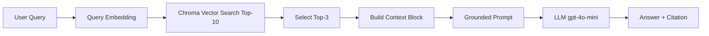
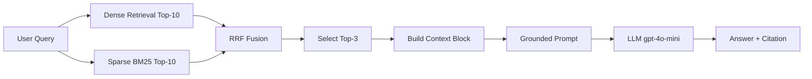
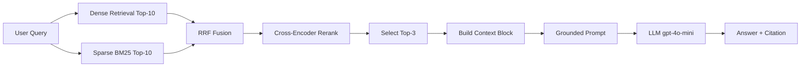

# Architecture — RAG Pipeline (Day 08 Lab)

> Template: Điền vào các mục này khi hoàn thành từng sprint.
> Deliverable của Documentation Owner.

## 1. Tổng quan kiến trúc

```
[Raw Docs]
    ↓
[index.py: Preprocess → Chunk → Embed → Store]
    ↓
[ChromaDB Vector Store]
    ↓
[rag_answer.py: Query → Retrieve → Rerank → Generate]
    ↓
[Grounded Answer + Citation]
```

**Mô tả ngắn gọn:**
> Nhóm xây một trợ lý nội bộ RAG cho khối CS và IT Helpdesk để trả lời câu hỏi về SLA, hoàn tiền, cấp quyền truy cập và FAQ vận hành. Hệ thống dùng retrieval có kiểm soát từ kho tài liệu policy/SOP nội bộ, sau đó sinh câu trả lời grounded kèm citation. Mục tiêu chính là giảm hallucination và tăng khả năng truy vết nguồn khi hỗ trợ vận hành.

---

## 2. Indexing Pipeline (Sprint 1)

### Tài liệu được index
| File | Nguồn | Department | Số chunk |
|------|-------|-----------|---------|
| `policy_refund_v4.txt` | policy/refund-v4.pdf | CS | 6 |
| `sla_p1_2026.txt` | support/sla-p1-2026.pdf | IT | 5 |
| `access_control_sop.txt` | it/access-control-sop.md | IT Security | 8 |
| `it_helpdesk_faq.txt` | support/helpdesk-faq.md | IT | 6 |
| `hr_leave_policy.txt` | hr/leave-policy-2026.pdf | HR | 5 |

### Quyết định chunking
| Tham số | Giá trị | Lý do |
|---------|---------|-------|
| Chunk size | 300 tokens (Tổng data: 10971 chars) | Giữ đủ ngữ cảnh điều khoản nhưng không làm context quá dài |
| Overlap | 60 tokens | Giảm mất mát thông tin ở ranh giới chunk |
| Chunking strategy | Heading-based + paragraph-aware split | Ưu tiên ranh giới tự nhiên theo `=== Section ===`, nếu dài thì tách theo đoạn, cuối cùng mới fallback cắt theo ký tự |
| Metadata fields | source, section, effective_date, department, access | Phục vụ filter, freshness, citation |

### Embedding model
- **Model**: `paraphrase-multilingual-MiniLM-L12-v2`
- **Vector store**: ChromaDB
- **Similarity metric**: Cosine distance (pipeline convert về score bằng `1 - distance` khi retrieve)

---

## 3. Retrieval Pipeline (Sprint 2 + 3)

### Baseline (Sprint 2)
| Tham số | Giá trị |
|---------|---------|
| Strategy | Dense (embedding similarity) |
| Top-k search | 10 |
| Top-k select | 3 |
| Rerank | Không |

### Variant (Sprint 3)
| Tham số | Giá trị | Thay đổi so với baseline |
|---------|---------|------------------------|
| Strategy | Hybrid (Dense + BM25 với RRF) | Đổi từ dense thuần sang kết hợp semantic + keyword |
| Top-k search | 10 | Giữ nguyên (đổi 1 biến chính là strategy + rerank) |
| Top-k select | 3 | Giữ nguyên để công bằng A/B |
| Rerank | Bật cross-encoder `cross-encoder/ms-marco-MiniLM-L-6-v2` | Bổ sung bước rerank sau retrieve để giảm noise |
| Query transform | Không dùng (identity query) | Giữ query gốc, chưa bật expansion/HyDE/decomposition |

**Lý do chọn variant này:**
> Nhóm chọn hybrid + rerank vì corpus có cả văn bản chính sách tự nhiên và cụm keyword chuyên ngành/mã quy trình (SLA P1, Approval Matrix, Access Control SOP). Dense-only cho recall tốt nhưng một số câu có nhiễu hoặc thiếu chính xác ngữ cảnh; thêm BM25 giúp giữ exact term, còn rerank giúp ưu tiên chunk liên quan nhất trước khi vào prompt.

---

## 4. Generation (Sprint 2)

### Grounded Prompt Template
```
Answer only from the retrieved context below. Do not use outside knowledge.

Decision rules:
1) If the context directly contains the requested information, answer directly with citation.
2) If the exact scenario is not explicitly documented, but a general policy/process in context clearly applies, say that the document does not specify a separate case and provide the applicable standard policy/process from context.
3) Only say "Không đủ dữ liệu trong tài liệu hiện có để trả lời câu hỏi này." when neither direct evidence nor an applicable general policy/process is available in the context.

Cite the source field (in brackets like [1]) when possible.
Keep your answer short, clear, and factual.
Answer only what the question asks; do not add adjacent policy details unless they are required to answer.
Respond in the same language as the question.

Question: {query}

Context:
{context_block}

Answer:
```

### LLM Configuration
| Tham số | Giá trị |
|---------|---------|
| Model | `gpt-4o-mini` |
| Temperature | 0 (để output ổn định cho eval) |
| Max tokens | 512 |

---

## 5. Failure Mode Checklist

> Dùng khi debug — kiểm tra lần lượt: index → retrieval → generation

| Failure Mode | Triệu chứng | Cách kiểm tra |
|-------------|-------------|---------------|
| Index lỗi | Retrieve về docs cũ / sai version | `inspect_metadata_coverage()` trong index.py |
| Chunking tệ | Chunk cắt giữa điều khoản | `list_chunks()` và đọc text preview |
| Retrieval lỗi | Không tìm được expected source | `score_context_recall()` trong eval.py |
| Generation lỗi | Answer không grounded / bịa | `score_faithfulness()` trong eval.py |
| Token overload | Context quá dài → lost in the middle | Kiểm tra độ dài context_block |

---

## 6. Diagram

Sơ đồ được tách riêng theo từng luồng để dễ trình bày khi demo.

### Luồng 1 — Baseline Dense (Sprint 2)



### Luồng 2 — Hybrid (Dense + BM25, không rerank)



### Luồng 3 — Hybrid + Rerank (Variant đang chạy)


