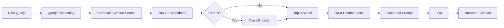

# Architecture — RAG Pipeline (Day 08 Lab)

> Template: Điền vào các mục này khi hoàn thành từng sprint.
> Deliverable của Documentation Owner.

## 1. Tổng quan kiến trúc

```
[Raw Docs]
    ↓
[index.py: Preprocess → Chunk → Embed → Store]
    ↓
[ChromaDB Vector Store]
    ↓
[rag_answer.py: Query → Retrieve → Rerank → Generate]
    ↓
[Grounded Answer + Citation]
```

**Mô tả ngắn gọn:**
> Nhóm xây dựng một pipeline RAG cho trợ lý nội bộ phục vụ khối CS và IT Helpdesk. Hệ thống index các policy, SLA, SOP và FAQ để trả lời câu hỏi dựa trên ngữ cảnh được retrieve từ ChromaDB, kèm citation nguồn. Mục tiêu là giảm trả lời sai hoặc bịa thông tin khi tra cứu tài liệu vận hành nội bộ.

---

## 2. Indexing Pipeline (Sprint 1)

### Tài liệu được index
| File | Nguồn | Department | Số chunk |
|------|-------|-----------|---------|
| `policy_refund_v4.txt` | policy/refund-v4.pdf | CS | 6 |
| `sla_p1_2026.txt` | support/sla-p1-2026.pdf | IT | 5 |
| `access_control_sop.txt` | it/access-control-sop.md | IT Security | 8 |
| `it_helpdesk_faq.txt` | support/helpdesk-faq.md | IT | 6 |
| `hr_leave_policy.txt` | hr/leave-policy-2026.pdf | HR | 5 |

### Quyết định chunking
| Tham số | Giá trị | Lý do |
|---------|---------|-------|
| Chunk size | 400 tokens | Nằm trong khoảng gợi ý 300-500 tokens, đủ giữ trọn một điều khoản/ngữ cảnh ngắn nhưng vẫn gọn cho retrieval |
| Overlap | 80 tokens | Giữ phần chuyển tiếp giữa các đoạn để giảm mất ngữ nghĩa khi chunk bị cắt gần ranh giới section/paragraph |
| Chunking strategy | Heading-based + paragraph-based fallback | Ưu tiên tách theo section `=== ... ===`, sau đó split theo ranh giới tự nhiên như đoạn văn, câu hoặc dòng mới nếu section quá dài |
| Metadata fields | source, section, effective_date, department, access | Phục vụ filter, freshness, citation |

### Embedding model
- **Model**: `text-embedding-3-small` (cấu hình chạy hiện tại qua `EMBEDDING_PROVIDER=openai`); code vẫn hỗ trợ `paraphrase-multilingual-MiniLM-L12-v2` ở chế độ local
- **Vector store**: ChromaDB (PersistentClient)
- **Similarity metric**: Cosine

---

## 3. Retrieval Pipeline (Sprint 2 + 3)

### Baseline (Sprint 2)
| Tham số | Giá trị |
|---------|---------|
| Strategy | Dense (embedding similarity) |
| Top-k search | 10 |
| Top-k select | 3 |
| Rerank | Không |

### Variant (Sprint 3)
| Tham số | Giá trị | Thay đổi so với baseline |
|---------|---------|------------------------|
| Strategy | Hybrid | Kết hợp dense retrieval với sparse BM25 bằng Reciprocal Rank Fusion thay vì chỉ dense |
| Top-k search | 10 | Giữ nguyên để A/B test chỉ đổi chiến lược retrieval |
| Top-k select | 3 | Giữ nguyên để so sánh công bằng với baseline |
| Rerank | Không | Không bật rerank để tránh đổi thêm biến ngoài retrieval strategy |
| Query transform | Không | Không dùng query expansion/HyDE/decomposition trong variant này |

**Lý do chọn variant này:**
> Chọn hybrid vì corpus có cả nội dung diễn đạt tự nhiên (policy, FAQ) lẫn keyword/alias chuyên biệt như `P1`, `CRITICAL`, hoặc tên gọi cũ như "Approval Matrix". Dense retrieval là baseline tốt cho ngữ nghĩa, nhưng hybrid giúp giữ thêm tín hiệu exact-match từ BM25 mà không phải đổi prompt hay thêm rerank. Trong log `grading_run.json`, hybrid đã retrieve đúng 2 nguồn cho các câu cross-document như `gq02` và `gq06`, nhưng chất lượng cuối cùng vẫn phụ thuộc mạnh vào generation/completeness.
> Ví dụ: "Chọn hybrid vì corpus có cả câu tự nhiên (policy) lẫn mã lỗi và tên chuyên ngành (SLA ticket P1, ERR-403)."

---

## 4. Generation (Sprint 2)

### Grounded Prompt Template
```
Answer only from the retrieved context below.
If the context is insufficient to answer the question, say you do not know and do not make up information.
Cite the source field (in brackets like [1]) when possible.
Keep your answer short, clear, and factual.
Respond in the same language as the question.

Question: {query}

Context:
[1] {source} | {section} | score={score}
{chunk_text}

[2] ...

Answer:
```

### LLM Configuration
| Tham số | Giá trị |
|---------|---------|
| Model | `gpt-4o-mini` (mặc định); hỗ trợ `gemini-1.5-flash` nếu cấu hình Gemini |
| Temperature | 0 (để output ổn định cho eval) |
| Max tokens | 512 |

---

## 5. Failure Mode Checklist

> Dùng khi debug — kiểm tra lần lượt: index → retrieval → generation

| Failure Mode | Triệu chứng | Cách kiểm tra |
|-------------|-------------|---------------|
| Index lỗi | Retrieve về docs cũ / sai version | `inspect_metadata_coverage()` trong index.py |
| Chunking tệ | Chunk cắt giữa điều khoản | `list_chunks()` và đọc text preview |
| Retrieval lỗi | Không tìm được expected source | `score_context_recall()` trong eval.py |
| Generation lỗi | Answer không grounded / bịa | `score_faithfulness()` trong eval.py |
| Token overload | Context quá dài → lost in the middle | Kiểm tra độ dài context_block |

**Failure đã gặp trong log chạy thực tế:**
- `q01`: retrieve đúng `sla_p1_2026.pdf` nhưng answer chọn nhầm chi tiết "24 giờ viết báo cáo sự cố" thay vì cặp SLA chính `15 phút / 4 giờ`.
- `gq02`: hybrid lấy được cả `hr_leave_policy` và `helpdesk_faq`, nhưng answer chỉ giữ lại chi tiết "2 thiết bị", bỏ mất yêu cầu VPN bắt buộc và tên phần mềm.
- `gq05`: answer nhầm hoàn toàn luồng `Admin Access (Level 4)` sang thông tin gần với level thấp hơn, cho thấy candidate đúng chưa đủ nếu model chọn sai evidence.
- `gq09`: answer đúng chu kỳ `90 ngày` và nhắc trước `7 ngày`, nhưng bỏ mất kênh reset password, nên completeness vẫn thấp.

---

## 6. Diagram (tùy chọn)

> Sơ đồ Mermaid của pipeline hiện tại:


