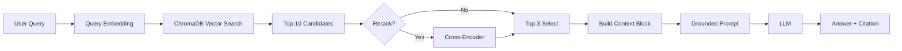

# Architecture — RAG Pipeline (Day 08 Lab)

> Template: Điền vào các mục này khi hoàn thành từng sprint.
> Deliverable của Documentation Owner.

## 1. Tổng quan kiến trúc

```
[Raw Docs]
    ↓
[index.py: Preprocess → Chunk → Embed → Store]
    ↓
[ChromaDB Vector Store]
    ↓
[rag_answer.py: Query → Retrieve → Rerank → Generate]
    ↓
[Grounded Answer + Citation]
```

**Mô tả ngắn gọn:**
Nhóm xây **trợ lý nội bộ cho CS + IT Helpdesk** để trả lời câu hỏi về **policy / SLA / quy trình cấp quyền / FAQ**.
Hệ thống dùng RAG để **retrieve chứng cứ từ tài liệu nội bộ** và sinh câu trả lời **ngắn gọn, có trích nguồn**, đồng thời **abstain** khi không đủ dữ liệu để tránh hallucination.

---

## 2. Indexing Pipeline (Sprint 1)

### Tài liệu được index
| File | Nguồn | Department | Số chunk |
|------|-------|-----------|---------|
| `policy_refund_v4.txt` | policy/refund-v4.pdf | CS | 6 |
| `sla_p1_2026.txt` | support/sla-p1-2026.pdf | IT | 5 |
| `access_control_sop.txt` | it/access-control-sop.md | IT Security | 8 |
| `it_helpdesk_faq.txt` | support/helpdesk-faq.md | IT | 6 |
| `hr_leave_policy.txt` | hr/leave-policy-2026.pdf | HR | 5 |

### Quyết định chunking
| Tham số | Giá trị | Lý do |
|---------|---------|-------|
| Chunk size | 400 tokens (ước lượng \(\approx\) 1600 chars) | Cân bằng giữa đủ ngữ cảnh để trả lời vs tránh context quá dài gây nhiễu |
| Overlap | 80 tokens (ước lượng \(\approx\) 320 chars) | Giảm mất mạch khi điều khoản nằm ở ranh giới chunk, tăng recall cho câu hỏi multi-sentence |
| Chunking strategy | Heading-based → paragraph-based (khi section dài) | Ưu tiên ranh giới tự nhiên theo section/đoạn để tránh cắt giữa điều khoản, sau đó mới giới hạn theo kích thước |
| Metadata fields | source, section, effective_date, department, access | Phục vụ filter, freshness, citation |

### Embedding model
- **Model**: OpenAI `text-embedding-3-small`
- **Vector store**: ChromaDB (PersistentClient)
- **Similarity metric**: Cosine

---

## 3. Retrieval Pipeline (Sprint 2 + 3)

### Baseline (Sprint 2)
| Tham số | Giá trị |
|---------|---------|
| Strategy | Dense (embedding similarity) |
| Top-k search | 10 |
| Top-k select | 3 |
| Rerank | Không (tuỳ chọn bật sau khi đã có baseline ổn định) |

### Variant (Sprint 3)
| Tham số | Giá trị | Thay đổi so với baseline |
|---------|---------|------------------------|
| Strategy | Hybrid (Dense + BM25 Sparse) với Reciprocal Rank Fusion (RRF) | Thay retrieval từ pure dense → hybrid để tăng recall với keyword/mã lỗi/tên riêng |
| Top-k search | 10 | Giữ nguyên |
| Top-k select | 3 | Giữ nguyên |
| Rerank | Bật cross-encoder (SentenceTransformers CrossEncoder) | Thêm rerank để giảm noise trước khi chọn top-3 chunks vào prompt |
| Query transform | Bật (expansion) | Thêm bước mở rộng query để tăng recall với alias/tên cũ |
| Hybrid weights | dense=0.6, sparse=0.4 | Cân bằng paraphrase (dense) và exact keyword/mã lỗi (sparse) |

**Lý do chọn variant này:**
Chọn **hybrid** vì corpus có cả câu tự nhiên (policy) lẫn **keyword/mã lỗi/tên gọi chuyên môn**; sparse (BM25) bắt đúng term, dense bắt được paraphrase.
RRF giúp gộp hai ranking mà vẫn giữ logic “search rộng → chọn top nhỏ” ổn định cho evaluation.
Ngoài ra nhóm bật **rerank** để giảm các chunk nhiễu trong top-k search, và bật **query expansion** để tăng khả năng bắt alias (ví dụ: “Approval Matrix” có thể nằm trong tài liệu quy trình cấp quyền).

---

## 4. Generation (Sprint 2)

### Grounded Prompt Template
```
Answer only from the retrieved context below.
If the context is insufficient, say you do not know.
Cite the source field when possible.
Keep your answer short, clear, and factual.

Question: {query}

Context:
[1] {source} | {section} | score={score}
{chunk_text}

[2] ...

Answer:
```

### LLM Configuration
| Tham số | Giá trị |
|---------|---------|
| Model | `gpt-4o-mini` (config qua biến môi trường `LLM_MODEL`) |
| Temperature | 0 (để output ổn định cho eval) |
| Max tokens | 512 |

---

## 5. Failure Mode Checklist

> Dùng khi debug — kiểm tra lần lượt: index → retrieval → generation

| Failure Mode | Triệu chứng | Cách kiểm tra |
|-------------|-------------|---------------|
| Index lỗi | Retrieve về docs cũ / sai version | `inspect_metadata_coverage()` trong index.py |
| Chunking tệ | Chunk cắt giữa điều khoản | `list_chunks()` và đọc text preview |
| Retrieval lỗi | Không tìm được expected source | `score_context_recall()` trong eval.py |
| Generation lỗi | Answer không grounded / bịa | `score_faithfulness()` trong eval.py |
| Token overload | Context quá dài → lost in the middle | Kiểm tra độ dài context_block |

---

## 6. Diagram (tùy chọn)

Sơ đồ pipeline (Mermaid):


