# Architecture — RAG Pipeline (Day 08 Lab)

## 1. Tổng quan kiến trúc

```text
[Raw Docs]
    ↓
[index.py: Preprocess → Chunk → Embed → Store]
    ↓
[ChromaDB Vector Store]
    ↓
[rag_answer.py: Query → Query Expansion / Router → Retrieve → Filter → Generate]
    ↓
[Grounded Answer + Citation]
```

**Mô tả ngắn gọn:**
Hệ thống là một pipeline RAG cho bộ tài liệu nội bộ gồm policy, SLA, SOP, FAQ và HR guideline. `index.py` chịu trách nhiệm biến tài liệu `.txt` thành các chunk có metadata và lưu vào ChromaDB; `rag_answer.py` dùng vector retrieval kết hợp query expansion, query router, source filter và grounded prompt để trả lời câu hỏi có dẫn nguồn.

---

## 2. Indexing Pipeline (Sprint 1)

### Tài liệu được index


| File                     | Nguồn                      | Department    | Số chunk |
| ------------------------ | -------------------------- | ------------- | -------- |
| `policy_refund_v4.txt`   | `policy/refund-v4.pdf`     | `CS`          | 6        |
| `sla_p1_2026.txt`        | `support/sla-p1-2026.pdf`  | `IT`          | 5        |
| `access_control_sop.txt` | `it/access-control-sop.md` | `IT Security` | 8        |
| `it_helpdesk_faq.txt`    | `support/helpdesk-faq.md`  | `IT`          | 6        |
| `hr_leave_policy.txt`    | `hr/leave-policy-2026.pdf` | `HR`          | 5        |


Ghi chú:

- `access_control_sop.txt` có thêm 1 alias chunk đặc biệt với section `Alias / Previous Name` để hỗ trợ query dùng tên cũ `Approval Matrix for System Access`.
- Số chunk ở bảng trên được đếm từ chính logic hiện tại của `preprocess_document()` và `chunk_document()`.

### Quyết định chunking


| Tham số           | Giá trị                                                       | Lý do                                                                                                     |
| ----------------- | ------------------------------------------------------------- | --------------------------------------------------------------------------------------------------------- |
| Chunk size        | `280` tokens ước lượng (`CHUNK_SIZE`)                         | Giảm trộn nhiều ý trong cùng một chunk so với bản trước                                                   |
| Overlap           | `50` tokens ước lượng (`CHUNK_OVERLAP`)                       | Giữ lại ngữ cảnh ngắn giữa hai chunk liền nhau                                                            |
| Chunking strategy | Heading-based trước, sau đó char-window fallback có overlap   | Code hiện split theo heading `=== ... ===`, nếu section dài thì `_split_by_size()` cắt tiếp theo số ký tự |
| Metadata fields   | `source`, `section`, `effective_date`, `department`, `access` | Phục vụ retrieval, filtering, citation và inspect                                                         |


Ghi chú:

- Source code có comment gợi ý paragraph-aware chunking, nhưng implementation hiện tại của `_split_by_size()` vẫn là cắt theo ký tự với overlap, chưa phải paragraph-aware hoàn chỉnh.

### Embedding model

- **Model**: `text-embedding-3-small`
- **Vector store**: ChromaDB `PersistentClient`
- **Collection name**: `rag_lab`
- **Similarity metric**: `cosine` qua `metadata={"hnsw:space": "cosine"}`

---

## 3. Retrieval Pipeline (Sprint 2 + 3)

### Baseline (Sprint 2)


| Tham số      | Giá trị |
| ------------ | ------- |
| Strategy     | `dense` |
| Top-k search | `10`    |
| Top-k select | `3`     |
| Rerank       | `False` |


### Variant hiện tại (Sprint 3)


| Tham số         | Giá trị       | Thay đổi so với baseline                            |
| --------------- | ------------- | --------------------------------------------------- |
| Strategy        | `auto` router | Không cố định một retrieval mode cho mọi query      |
| Top-k search    | `8`           | Giảm nhẹ để bớt candidate nhiễu                     |
| Top-k select    | `4`           | Tăng nhẹ để hỗ trợ câu hỏi nhiều vế                 |
| Rerank          | `False`       | Bỏ rerank mặc định vì biến thể trước gây regression |
| Query transform | `expansion`   | Thêm alias/keyword expansion trước khi retrieve     |


**Lý do chọn variant này:**
Các lần thử `hybrid + rerank` trước đó không tốt hơn baseline. Variant hiện tại giữ dense retrieval làm nền, sau đó bổ sung 4 lớp tune nhẹ hơn trong `rag_answer.py`: query expansion, query router, source/domain filter và postprocess guard.

### Logic retrieval thực tế trong source code

`rag_answer.py` hiện có các nhánh sau:

- `retrieve_dense()`: vector search trên ChromaDB bằng embedding của query.
- `retrieve_sparse()`: keyword overlap đơn giản trên toàn bộ documents trong collection.
- `retrieve_hybrid()`: ghép dense + sparse bằng `alpha=0.7` cho dense, `0.3` cho sparse.
- `_retrieve_with_expansion()`: chạy retrieval cho query gốc và các query mở rộng rồi merge lại.
- `_choose_query_strategy()`: nếu `retrieval_mode="auto"` thì:
  - mặc định dùng `dense`
  - nếu query chứa `approval matrix` hoặc `err-` thì chuyển sang `hybrid`
  - nếu query có dấu hiệu nhiều vế thì tăng `top_k_select` lên `4`
- `_filter_candidates_by_query()`: ưu tiên candidate theo nhóm source phù hợp với domain của câu hỏi.

### Query expansion hiện có

`transform_query()` hiện mở rộng một số alias/keyword cụ thể:

- `approval matrix` → `access control sop`, `approval matrix for system access`, `tên mới access control sop`
- `approval matrix for system access` → `access control sop`, `tên cũ approval matrix`
- `err-403-auth` → `authentication error`, `it helpdesk`, `helpdesk ext. 9000`
- `khách hàng vip` → `quy trình hoàn tiền`, `finance team xử lý 3-5 ngày`
- `remote` → `remote work`, `onsite`, `hybrid work`

---

## 4. Generation (Sprint 2)

### Grounded Prompt Template

```text
Answer only from the retrieved context below.

Rules:
1. Answer only what the question asks. Do not add extra facts unless they are necessary.
2. If the question has multiple parts, answer every part explicitly.
3. If the context contains a general rule and an explicit exception, the exception overrides the general rule.
4. If a special case is not documented, say it is not documented, then provide the closest standard policy from the context.
5. If the exact term or code is not found, do not infer a specific process from a different document.
6. Prefer the most directly relevant source and avoid mixing unrelated procedures.
7. Include required conditions, approvers, limits, and extra requirements when they are part of the answer.
8. If the context is insufficient, say you do not know. Do not make up information.
9. Cite the source block number like [1], [2] when possible.
10. Respond in the same language as the question.

Question: {query}

Context:
{context_block}

Answer:
```

### LLM Configuration


| Tham số               | Giá trị                               |
| --------------------- | ------------------------------------- |
| Provider mặc định     | `openai`                              |
| Provider thay thế     | `gemini`                              |
| Model mặc định        | `gpt-4o-mini` qua `LLM_MODEL`         |
| Gemini fallback model | `gemini-1.5-flash` qua `GEMINI_MODEL` |
| Temperature           | `0`                                   |
| Max tokens            | `1024`                                |


Ghi chú:

- Runtime model thực tế có thể khác nếu `.env` override `LLM_PROVIDER`, `LLM_MODEL` hoặc `GEMINI_MODEL`.
- Source code không lưu lịch sử model đã dùng cho từng lần chạy, nên tài liệu này chỉ phản ánh default hiện tại trong code.

### Postprocess guard hiện có

Sau khi gọi LLM, `_postprocess_answer()` đang xử lý thêm cho một số case:

- Alias `Approval Matrix` → ép answer về `Access Control SOP` nếu context có bằng chứng.
- `ERR-*` không có trong context → trả lời an toàn theo hướng liên hệ IT Helpdesk.
- `VIP` + answer abstain nhưng context có quy trình chuẩn → trả lời theo policy chuẩn 3-5 ngày làm việc.

---

## 5. Failure Mode Checklist


| Failure Mode              | Triệu chứng                                               | Cách kiểm tra                                                              |
| ------------------------- | --------------------------------------------------------- | -------------------------------------------------------------------------- |
| Index lỗi                 | Retrieve về docs cũ hoặc không thấy alias chunk           | Chạy lại `build_index()` và `list_chunks()`                                |
| Chunking tệ               | Một câu trả lời bị trộn nhiều policy/ngoại lệ             | Inspect chunk preview bằng `list_chunks()`                                 |
| Retrieval sai domain      | Query SLA nhưng lại kéo chunk access/refund               | In `sources` và `chunks_used` từ `rag_answer()`                            |
| Expansion/router sai      | Variant không tốt hơn baseline ở câu alias/special case   | So sánh `config`, `sources`, `answer` trong `eval.json`                    |
| Generation không grounded | Answer thêm thông tin ngoài context hoặc bỏ sót điều kiện | Đối chiếu `answer` với `context_block` và điểm `faithfulness/completeness` |
| Postprocess quá tay       | Answer bị cứng hoặc template hóa quá mức                  | So sánh raw answer trước/sau `_postprocess_answer()`                       |


---

## 6. Diagram

```mermaid
graph LR
    A[User Query] --> B[Query Router]
    B --> C[Query Expansion]
    C --> D[Dense / Sparse / Hybrid Retrieval]
    D --> E[Merge Results]
    E --> F[Source / Domain Filter]
    F --> G[Top-k Select]
    G --> H[Build Context Block]
    H --> I[Grounded Prompt v3]
    I --> J[LLM]
    J --> K[Postprocess Guard]
    K --> L[Answer + Citation]
```




---

