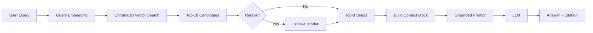

# Architecture — RAG Pipeline (Day 08 Lab)

> Template: Điền vào các mục này khi hoàn thành từng sprint.
> Deliverable của Documentation Owner.

## 1. Tổng quan kiến trúc

```
[Raw Docs]
    ↓
[index.py: Preprocess → Chunk → Embed → Store]
    ↓
[ChromaDB Vector Store]
    ↓
[rag_answer.py: Query → Retrieve → Rerank → Generate]
    ↓
[Grounded Answer + Citation]
```

**Mô tả ngắn gọn:**
Hệ thống RAG Helpdesk được xây dựng để hỗ trợ nhân viên CS/IT tra cứu nhanh các quy trình nội bộ (SLA, nghỉ phép, refund, cấp quyền hệ thống). Giải pháp sử dụng kiến trúc RAG nâng cao kết hợp Hybrid Search và Rerank để đảm bảo tính chính xác và giảm thiểu tình trạng AI bịa đặt (hallucination).

---

## 2. Indexing Pipeline (Sprint 1)

### Tài liệu được index
| File | Nguồn | Department | Số chunk |
|------|-------|-----------|---------|
| `policy_refund_v4.txt` | policy/refund-v4.pdf | CS | 6 |
| `sla_p1_2026.txt` | support/sla-p1-2026.pdf | IT | 8 |
| `access_control_sop.txt` | it/access-control-sop.md | IT Security | 10 |
| `it_helpdesk_faq.txt` | support/helpdesk-faq.md | IT | 13 |
| `hr_leave_policy.txt` | hr/leave-policy-2026.pdf | HR | 5 |

### Quyết định chunking
| Tham số | Giá trị | Lý do |
|---------|---------|-------|
| Chunk size | 400 tokens | Phù hợp với độ dài một điều khoản/paragraph |
| Overlap | 80 tokens | Tránh mất ngữ cảnh ở ranh giới cắt |
| Chunking strategy | Heading-based + Paragraph-based | Giữ tính toàn vẹn của một Section (SLA, SLA P1...) |
| Metadata fields | source, section, effective_date, department, access | Phục vụ filter, freshness, citation |

### Embedding model
- **Model**: OpenAI text-embedding-3-small
- **Vector store**: ChromaDB (PersistentClient)
- **Similarity metric**: Cosine

---

## 3. Retrieval Pipeline (Sprint 2 + 3)

### Baseline (Sprint 2)
| Tham số | Giá trị |
|---------|---------|
| Strategy | Dense (embedding similarity) |
| Top-k search | 10 |
| Top-k select | 3 |
| Rerank | Không |

### Variant (Sprint 3)
| Tham số | Giá trị | Thay đổi so với baseline |
|---------|---------|------------------------|
| Strategy | Hybrid (Dense + Sparse) + Rerank | Kết hợp ngữ nghĩa, từ khóa và kiểm chứng lại |
| Top-k search | 10 | Đảm bảo thu hồi (Recall) tối đa |
| Top-k select | 3 | Tối ưu độ tập trung cho LLM |
| Rerank | Cross-Encoder (MiniLM) | Lọc bỏ kết quả "nhiễu" từ Hybrid Search |

**Lý do chọn variant này:**
Hệ thống xử lý tốt các câu hỏi về chính sách chung nhưng gặp khó khăn với các mã lỗi (P1, ERR-403) và các tên gọi cũ (Approval Matrix). Hybrid Search giúp bắt được từ khóa chính xác, trong khi Rerank đảm bảo thông tin quan trọng nhất luôn nằm ở Top 1.

---

## 4. Generation (Sprint 2)

### Grounded Prompt Template
Cấu hình prompt ép mô hình chỉ trả lời từ Context và trích dẫn [1], [2]. Bao gồm các metadata Department và Effective Date để xử lý câu hỏi theo phòng ban và thời gian hiệu lực.

### LLM Configuration
| Tham số | Giá trị |
|---------|---------|
| Model | OpenAI gpt-4o-mini |
| Temperature | 0 (để tránh bịa đặt và đảm bảo nhất quán) |
| Max tokens | 600 |

---

## 5. Failure Mode Checklist

> Dùng khi debug — kiểm tra lần lượt: index → retrieval → generation

| Failure Mode | Triệu chứng | Cách kiểm tra |
|-------------|-------------|---------------|
| Index lỗi | Retrieve về docs cũ / sai version | `inspect_metadata_coverage()` trong index.py |
| Chunking tệ | Chunk cắt giữa điều khoản | `list_chunks()` và đọc text preview |
| Retrieval lỗi | Không tìm được expected source | `score_context_recall()` trong eval.py |
| Generation lỗi | Answer không grounded / bịa | `score_faithfulness()` trong eval.py |
| Token overload | Context quá dài → lost in the middle | Kiểm tra độ dài context_block |

---

## 6. Diagram (tùy chọn)

> TODO: Vẽ sơ đồ pipeline nếu có thời gian. Có thể dùng Mermaid hoặc drawio.


