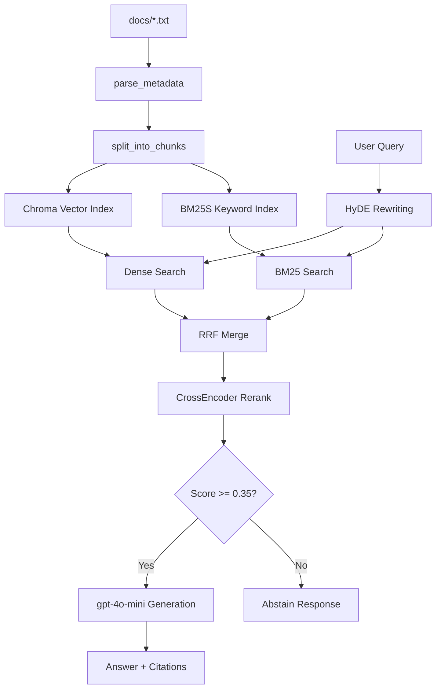

# Architecture — RAG Pipeline (Day 08 Lab)

> Template: Điền vào các mục này khi hoàn thành từng sprint.
> Deliverable của Documentation Owner.

## 1. Tổng quan kiến trúc

```
[Raw Docs]
    ↓
[index.py: Preprocess → Chunk → Embed → Store]
    ↓
[ChromaDB Vector Store]
    ↓
[rag_answer.py: Query → Retrieve → Rerank → Generate]
    ↓
[Grounded Answer + Citation]
```

**Mô tả ngắn gọn:**
Hệ thống là một trợ lý ảo RAG nội bộ dành cho khối CS (Customer Service) và IT Helpdesk. Trợ lý này giúp nhân viên truy xuất nhanh và trả lời chính xác các câu hỏi về chính sách, SLA, và quy trình cấp quyền dựa trên chứng cứ cụ thể, giúp giảm thiểu rủi ro sai sót thông tin.

---

## 2. Indexing Pipeline (Sprint 1)

### Tài liệu được index
| File | Nguồn | Department | Số chunk |
|------|-------|-----------|---------|
| `policy_refund_v4.txt` | policy/refund-v4.pdf | CS | TODO |
| `sla_p1_2026.txt` | support/sla-p1-2026.pdf | IT | TODO |
| `access_control_sop.txt` | it/access-control-sop.md | IT Security | TODO |
| `it_helpdesk_faq.txt` | support/helpdesk-faq.md | IT | TODO |
| `hr_leave_policy.txt` | hr/leave-policy-2026.pdf | HR | TODO |

### Quyết định chunking
| Tham số | Giá trị | Lý do |
|---------|---------|-------|
| Chunking strategy | Semantic split (theo heading `===`) | Giữ nguyên vẹn toàn bộ một đoạn điều khoản/quy trình, tránh tình trạng bị chia cắt ngang câu như chia theo character split cứng. |
| Metadata fields | `source`, `section`, `effective_date`, `department`, `chunk_id`, `aliases` | Phục vụ filter, đánh giá freshness, tạo citation chính xác, và hỗ trợ tìm kiếm bằng alias. |

### Embedding model
- **Model**: TODO (OpenAI text-embedding-3-small / paraphrase-multilingual-MiniLM-L12-v2)
- **Vector store**: ChromaDB (PersistentClient)
- **Similarity metric**: Cosine

---

## 3. Retrieval Pipeline (Sprint 2 + 3)

### Baseline (Sprint 2)
| Tham số | Giá trị |
|---------|---------|
| Strategy | Dense (embedding similarity) |
| Top-k search | 10 |
| Top-k select | 3 |
| Rerank | Không |

### Variant (Sprint 3)
| Tham số | Giá trị | Thay đổi so với baseline |
|---------|---------|------------------------|
| Strategy | TODO (hybrid / dense) | TODO |
| Top-k search | TODO | TODO |
| Top-k select | TODO | TODO |
| Rerank | TODO (cross-encoder / MMR) | TODO |
| Query transform | TODO (expansion / HyDE / decomposition) | TODO |

**Lý do chọn variant này:**
> TODO: Giải thích tại sao chọn biến này để tune.
> Ví dụ: "Chọn hybrid vì corpus có cả câu tự nhiên (policy) lẫn mã lỗi và tên chuyên ngành (SLA ticket P1, ERR-403)."

---

## 4. Generation (Sprint 2)

### Grounded Prompt Template
```
Answer only from the retrieved context below.
If the context is insufficient, say you do not know.
Cite the source field when possible.
Keep your answer short, clear, and factual.

Question: {query}

Context:
[1] {source} | {section} | score={score}
{chunk_text}

[2] ...

Answer:
```

### LLM Configuration
| Tham số | Giá trị |
|---------|---------|
| Model | TODO (gpt-4o-mini / gemini-1.5-flash) |
| Temperature | 0 (để output ổn định cho eval) |
| Max tokens | 512 |

---

## 5. Failure Mode Checklist

> Dùng khi debug — kiểm tra lần lượt: index → retrieval → generation

| Failure Mode | Triệu chứng | Cách kiểm tra |
|-------------|-------------|---------------|
| Index lỗi | Retrieve về docs cũ / sai version | `inspect_metadata_coverage()` trong index.py |
| Chunking tệ | Chunk cắt giữa điều khoản | `list_chunks()` và đọc text preview |
| Retrieval lỗi | Không tìm được expected source | `score_context_recall()` trong eval.py |
| Generation lỗi | Answer không grounded / bịa | `score_faithfulness()` trong eval.py |
| Token overload | Context quá dài → lost in the middle | Kiểm tra độ dài context_block |

---

## 6. Pipeline Diagram


