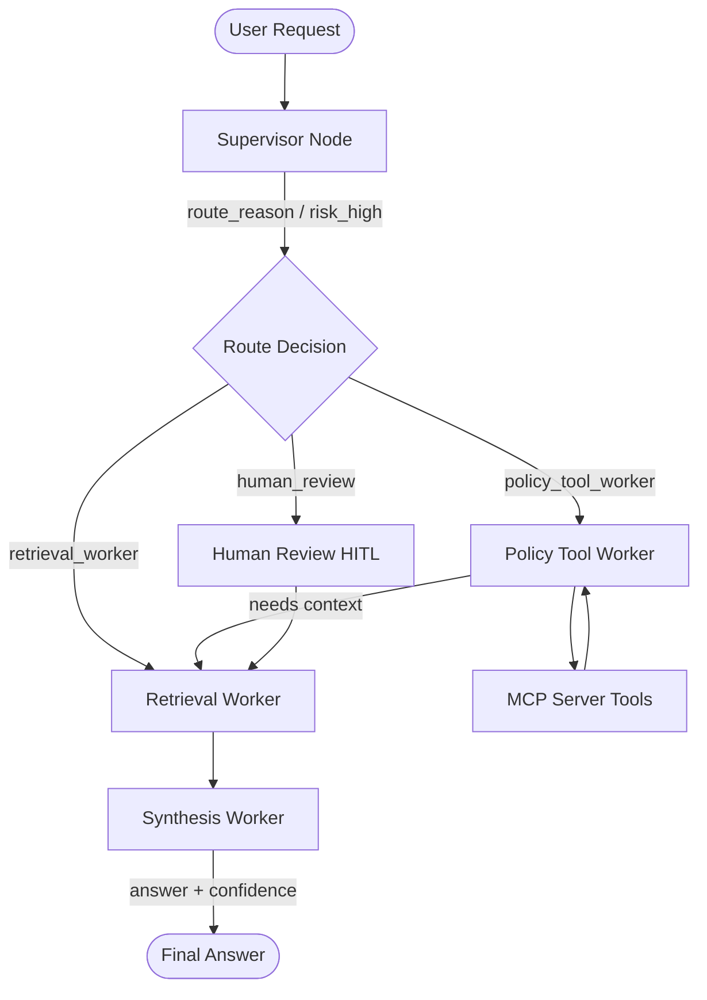

# System Architecture — Lab Day 09

**Nhóm:** C401-A2
**Ngày:** 2026-04-14
**Version:** 1.0

---

## 1. Tổng quan kiến trúc

Hệ thống được thiết kế theo mô hình **Multi-Agent Orchestration**, chuyển đổi từ kiến trúc RAG đơn luồng của Lab 08 sang kiến trúc có điều phối viên (Supervisor) và các nhân viên chuyên trách (Workers).

**Pattern đã chọn:** Supervisor-Worker
**Lý do chọn pattern này (thay vì single agent):**
1. **Khả năng phân tách trách nhiệm**: Mỗi worker (Retrieval, Policy, Synthesis) tập trung vào một nhiệm vụ duy nhất, giúp code sạch và dễ bảo trì.
2. **Kiểm soát luồng (Control flow)**: Supervisor cho phép định tuyến thông minh, bỏ qua các bước không cần thiết hoặc yêu cầu Human-in-the-loop khi gặp rủi ro cao.
3. **Dễ dàng mở rộng**: Có thể thêm Tool mới qua MCP hoặc thêm Worker mới mà không làm xáo trộn logic hiện có.

---

## 2. Sơ đồ Pipeline

Hệ thống sử dụng supervisor_node để định tuyến giữa các Worker.

---

## 3. Vai trò từng thành phần

### Supervisor (`graph.py`)

| Thuộc tính | Mô tả |
|-----------|-------|
| **Nhiệm vụ** | Phân tích câu hỏi, quyết định Agent nào sẽ xử lý và đánh giá mức độ rủi ro. |
| **Input** | `task` (câu hỏi từ người dùng) |
| **Output** | `supervisor_route`, `route_reason`, `risk_high`, `needs_tool` |
| **Routing logic** | Rule-based (Keyword matching) cho các danh mục câu hỏi (SLA, Refund, Access, IT FAQ, System Error). |
| **HITL condition** | Khi phát hiện mã lỗi `ERR-` hoặc từ khóa rủi ro cao (`emergency`, `khẩn cấp`). |

### Retrieval Worker (`workers/retrieval.py`)

| Thuộc tính | Mô tả |
|-----------|-------|
| **Nhiệm vụ** | Thực hiện tra cứu ngữ cảnh từ cơ sở tri thức (Knowledge Base). |
| **Embedding model** | `google/embeddinggemma-300m` (Đồng bộ với Lab 08) |
| **Top-k** | 3 - 5 tùy thuộc vào yêu cầu của Supervisor |
| **Stateless?** | Yes |

### Policy Tool Worker (`workers/policy_tool.py`)

| Thuộc tính | Mô tả |
|-----------|-------|
| **Nhiệm vụ** | Phân tích chính sách, phát hiện ngoại lệ và gọi các công cụ bên ngoài qua MCP. |
| **MCP tools gọi** | `search_kb`, `get_ticket_info`, `check_access_permission`, `create_ticket`. |
| **Exception cases xử lý** | Đơn hàng Flash Sale, Sản phẩm kỹ thuật số, Đơn hàng trước ngày 01/02/2026. |

### Synthesis Worker (`workers/synthesis.py`)

| Thuộc tính | Mô tả |
|-----------|-------|
| **LLM model** | `gpt-4o-mini` (via GitHub Models) |
| **Temperature** | 0.1 (để đảm bảo tính ổn định) |
| **Grounding strategy** | Strict Grounding: Chỉ trả lời dựa trên context được cung cấp. |
| **Abstain condition** | Khi không tìm thấy thông tin phù hợp trong evidence. |

### MCP Server (`mcp_server.py`)

| Tool | Input | Output |
|------|-------|--------|
| search_kb | query, top_k | chunks, sources |
| get_ticket_info | ticket_id | ticket details (Mock data) |
| check_access_permission | level, requester_role | can_grant, approvers |
| create_ticket | priority, title, desc | ticket_id, url |

---

## 4. Shared State Schema

| Field | Type | Mô tả | Ai đọc/ghi |
|-------|------|-------|-----------|
| task | str | Câu hỏi đầu vào | supervisor đọc |
| supervisor_route | str | Worker được chọn | supervisor ghi |
| route_reason | str | Lý do route | supervisor ghi |
| retrieved_chunks | list | Evidence từ retrieval | retrieval ghi, synthesis đọc |
| policy_result | dict | Kết quả kiểm tra policy | policy_tool ghi, synthesis đọc |
| mcp_tools_used | list | Tool calls đã thực hiện | policy_tool ghi |
| history | list | Nhật ký các bước xử lý | Tất cả ghi |
| final_answer | str | Câu trả lời cuối | synthesis ghi |

---

## 5. Lý do chọn Supervisor-Worker so với Single Agent (Day 08)

| Tiêu chí | Single Agent (Day 08) | Supervisor-Worker (Day 09) |
|----------|----------------------|--------------------------|
| Debug khi sai | Khó — không rõ lỗi ở đâu | Dễ hơn — có thể test từng worker độc lập |
| Thêm capability mới | Phải sửa toàn bộ prompt | Thêm worker/MCP tool riêng biệt |
| Routing visibility | Không có | Có route_reason trong trace rõ ràng |
| Hiệu năng | Thấp (Direct call) | Cao hơn (nhiều bước orchestrate) |

**Nhóm điền thêm quan sát từ thực tế lab:**
Hệ thống Multi-agent cho phép can thiệp vào từng bước xử lý (như normalize text, validate context) mà không cần thay đổi prompt lớn, giúp giảm thiểu hallucination hiệu quả hơn Day 08.

---

## 6. Giới hạn và điểm cần cải tiến

1. **Độ trễ**: Thời gian phản hồi trung bình (~21s) tăng lên do hệ thống có nhiều bước trung gian và tải mô hình embedding local.
2. **Routing Logic**: Keyword-based routing nhạy cảm với việc thay đổi ngôn ngữ, cần nâng cấp lên LLM classifier.
3. **Chi phí**: Nhiều lần gọi API LLM hơn so với pipeline đơn giản.
