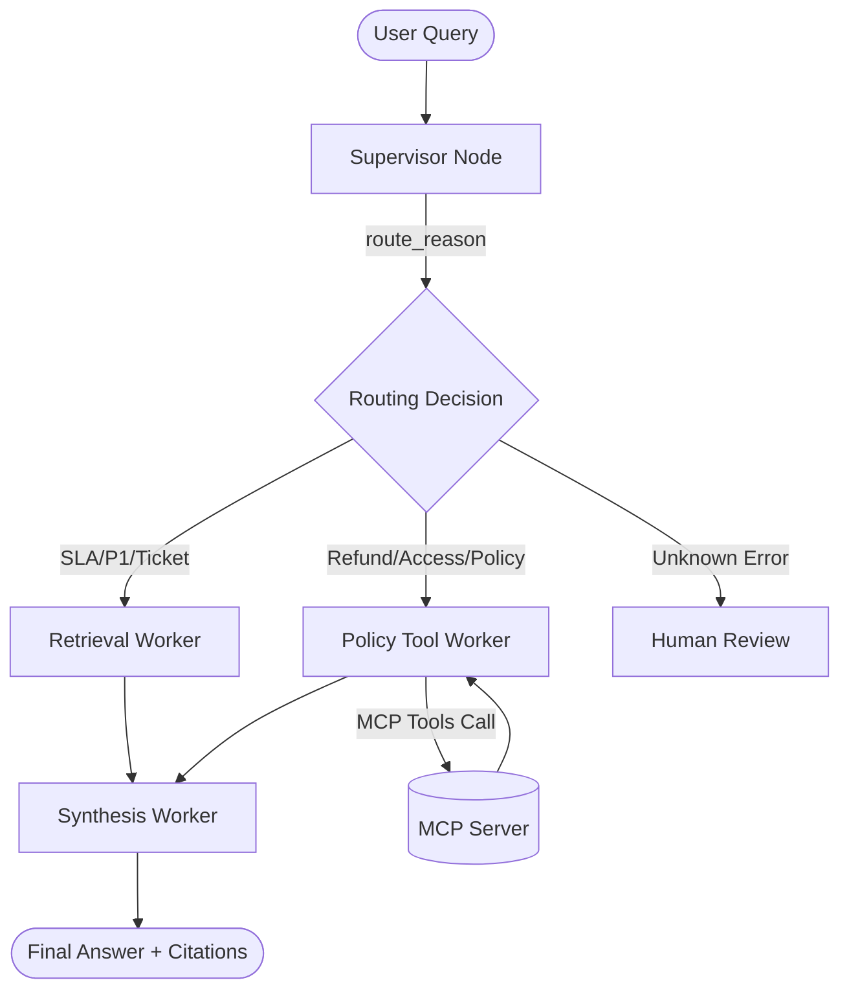

# System Architecture — Lab Day 09

**Nhóm:** AI in Action (AICB-P1)
**Ngày:** 14/04/2026
**Version:** 1.0

---

## 1. Tổng quan kiến trúc

Hệ thống trợ lý nội bộ Day 09 được tái cấu trúc từ một RAG pipeline đơn dạng (monolith) sang mô hình **Supervisor-Worker**. Kiến trúc này tách biệt tầng điều hướng (routing) và tầng xử lý nghiệp vụ (skill workers), cho phép hệ thống mở rộng linh hoạt và dễ dàng kiểm soát luồng dữ liệu.

**Pattern đã chọn:** Supervisor-Worker
**Lý do chọn pattern này (thay vì single agent):**
1. **Khả năng gỡ lỗi (Debuggability):** Trace logs ghi lại từng bước quyết định của Supervisor, giúp xác định lỗi do định tuyến sai hay do worker xử lý kém.
2. **Tính chuyên môn hóa:** Mỗi Worker chịu trách nhiệm một domain cụ thể (Retrieval, Policy, Synthesis), giúp prompt ngắn gọn và chính xác hơn.
3. **Mở rộng qua MCP:** Dễ dàng tích hợp thêm các công cụ bên ngoài mà không cần sửa đổi logic cốt lõi của Agent.

---

## 2. Sơ đồ Pipeline

Kiến trúc hệ thống sử dụng một Supervisor duy nhất để phân luồng dựa trên từ khóa và mức độ rủi ro của task.

---

## 3. Vai trò từng thành phần

### Supervisor (`graph.py`)

| Thuộc tính | Mô tả |
|-----------|-------|
| **Nhiệm vụ** | Phân tích câu hỏi, quyết định Worker phù hợp và đánh giá mức độ rủi ro. |
| **Input** | `task` (câu hỏi từ user). |
| **Output** | `supervisor_route`, `route_reason`, `risk_high`, `needs_tool`. |
| **Routing logic** | Dựa trên keyword-matching hỗ trợ bởi regex để phân loại (SLA, Refund, Access Control). |
| **HITL condition** | Kích hoạt khi gặp mã lỗi không rõ (ERR-xxx) hoặc từ khóa khẩn cấp/2am. |

### Retrieval Worker (`workers/retrieval.py`)

| Thuộc tính | Mô tả |
|-----------|-------|
| **Nhiệm vụ** | Truy xuất các đoạn văn bản (chunks) có liên quan nhất từ cơ sở dữ liệu tri thức. |
| **Embedding model** | `text-embedding-3-small` (OpenAI) hoặc `all-MiniLM-L6-v2`. |
| **Top-k** | Default k=3 (có thể điều chỉnh qua state). |
| **Stateless?** | Yes, có thể gọi độc lập để kiểm tra độ phủ nguồn. |

### Policy Tool Worker (`workers/policy_tool.py`)

| Thuộc tính | Mô tả |
|-----------|-------|
| **Nhiệm vụ** | Kiểm tra các quy tắc chính sách, phát hiện ngoại lệ (e.g. Flash Sale) và gọi công cụ ngoài. |
| **MCP tools gọi** | `search_kb`, `get_ticket_info`, `check_access_permission`. |
| **Exception cases xử lý** | Flash Sale, Digital products, Activated products, Temporal scoping (v3 vs v4). |

### Synthesis Worker (`workers/synthesis.py`)

| Thuộc tính | Mô tả |
|-----------|-------|
| **LLM model** | `gpt-4o-mini`. |
| **Temperature** | 0 (để đảm bảo tính nhất quán và chính xác). |
| **Grounding strategy** | Chỉ sử dụng thông tin từ `retrieved_chunks` và `policy_result` được cung cấp. |
| **Abstain condition** | Khi không có context liên quan hoặc mức độ tin cậy (`confidence`) < 0.4. |

### MCP Server (`mcp_server.py`)

| Tool | Input | Output |
|------|-------|--------|
| search_kb | query, top_k | chunks, sources |
| get_ticket_info | ticket_id | Chi tiết ticket Jira, tình trạng P1, escalation log |
| check_access_permission | access_level, role, is_emergency | Kết quả can_grant, danh sách người phê duyệt |
| create_ticket | priority, title, desc | ticket_id, URL Jira (MOCK) |

---

## 4. Shared State Schema

Hệ thống sử dụng một `AgentState` duy nhất để truyền thông tin giữa các nodes.

| Field | Type | Mô tả | Ai đọc/ghi |
|-------|------|-------|-----------|
| task | str | Câu hỏi gốc từ user | Supervisor (đọc) |
| supervisor_route | str | Tên worker được chọn để xử lý | Supervisor (ghi) |
| route_reason | str | Giải thích chi tiết lý do định tuyến | Supervisor (ghi) |
| retrieved_chunks | list | Danh sách bằng chứng trích xuất từ ChromaDB | Retrieval (ghi), Synthesis (đọc) |
| policy_result | dict | Kết quả phân tích ngoại lệ và quy định | Policy (ghi), Synthesis (đọc) |
| mcp_tools_used | list | Lịch sử các tool calls qua giao thức MCP | Policy (ghi) |
| final_answer | str | Câu trả lời cuối cùng có kèm trích dẫn | Synthesis (ghi) |
| confidence | float | Điểm tin cậy của câu trả lời (0.0 - 1.0) | Synthesis (ghi) |
| history | list | Tuyến vết hoạt động của toàn hệ thống | Tất cả (append) |

---

## 5. Lý do chọn Supervisor-Worker so với Single Agent (Day 08)

| Tiêu chí | Single Agent (Day 08) | Supervisor-Worker (Day 09) |
|----------|----------------------|--------------------------|
| Debug khi sai | Khó — không rõ lỗi ở tầng retrieve hay reasoning | Dễ — trace ghi rõ supervisor_route và từng worker log |
| Thêm capability mới | Phải sửa toàn bộ Prompt lớn, dễ gây side-effect | Thêm Worker mới hoặc MCP Tool không ảnh hưởng node khác |
| Routing visibility | Không có sự minh bạch trong việc chọn logic | Minh bạch qua route_reason và mcp_tools_used |
| Xử lý Multi-hop | Kém do context window bị loãng | Tốt nhờ phân tách bước tìm tài liệu và kiểm tra policy |

---

## 6. Giới hạn và điểm cần cải tiến

1. **Định tuyến tĩnh**: Hiện tại tập trung vào keyword-matching, có thể nâng cấp lên LLM-based classifier để tăng độ linh hoạt.
2. **Latency**: Mô hình multi-node tăng overhead thời gian gọi API so với monolith.
3. **Mô phỏng MCP**: Hiện tại dùng Mock Server trong cùng process, cần chuyển sang HTTP server để đúng chuẩn protocol.
