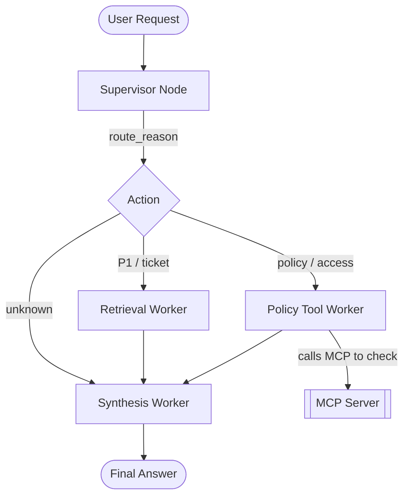

# System Architecture — Lab Day 09

**Nhóm:** E403_Team61
**Ngày:** 14/04/2026
**Version:** 1.0

---

## 1. Tổng quan kiến trúc

> Cấu trúc được chia nhỏ thành các module có vai trò rõ ràng, cho phép xử lý và route linh hoạt.

**Pattern đã chọn:** Supervisor-Worker  
**Lý do chọn pattern này (thay vì single agent):**
Do hệ thống single-agent trước đó đã quá tải với nhiều pattern query (policy vs technical support). Việc sử dụng Supervisor-Worker giúp tách bạch rủi ro hallucination, dễ kiểm tra logs ở từng bước và cho phép dễ dàng nối thêm MCP capability vào một worker riêng biệt không gây ảnh hưởng luồng chính.

---

## 2. Sơ đồ Pipeline

**Sơ đồ thực tế của nhóm:**

---

## 3. Vai trò từng thành phần

### Supervisor (`graph.py`)

| Thuộc tính | Mô tả |
|-----------|-------|
| **Nhiệm vụ** | Điều phối câu hỏi, phân loại dựa trên intent (SLA, Ticket, Access, Flash sale) |
| **Input** | `state["task"]`, `state["history"]` |
| **Output** | `supervisor_route`, `route_reason`, `risk_high`, `needs_tool` |
| **Routing logic** | Regex hoặc Keyword Matching đơn giản (nhanh và rẻ) |
| **HITL condition** | Khi risk cao hoặc policy edge-case không xác định (như hỏi về ticket không có ID) |

### Retrieval Worker (`workers/retrieval.py`)

| Thuộc tính | Mô tả |
|-----------|-------|
| **Nhiệm vụ** | Rút trích document từ ChromaDB theo câu hỏi SLA/P1 |
| **Embedding model** | all-MiniLM-L6-v2 |
| **Top-k** | 3 chunks |
| **Stateless?** | Yes |

### Policy Tool Worker (`workers/policy_tool.py`)

| Thuộc tính | Mô tả |
|-----------|-------|
| **Nhiệm vụ** | Xử lý các nghiệp vụ hoàn tiền đặc thù và access control |
| **MCP tools gọi** | `search_kb`, `get_ticket_info` |
| **Exception cases xử lý** | Đơn hàng Flash Sale không được refund hoặc Digital Product |

### Synthesis Worker (`workers/synthesis.py`)

| Thuộc tính | Mô tả |
|-----------|-------|
| **LLM model** | gpt-4o-mini |
| **Temperature** | 0.0 (để kết quả ground chặt với context) |
| **Grounding strategy** | Chỉ summarize context từ `retrieved_chunks` hoặc `policy_result` |
| **Abstain condition** | Khi evidence list rỗng hoặc tool không trả về thông tin |

### MCP Server (`mcp_server.py`)

| Tool | Input | Output |
|------|-------|--------|
| search_kb | query, top_k | chunks, sources |
| get_ticket_info | ticket_id | ticket details (mock data) |

---

## 4. Shared State Schema

| Field | Type | Mô tả | Ai đọc/ghi |
|-------|------|-------|-----------|
| task | str | Câu hỏi đầu vào | supervisor đọc |
| supervisor_route | str | Worker được chọn | supervisor ghi |
| route_reason | str | Lý do route | supervisor ghi |
| retrieved_chunks | list | Evidence từ retrieval | retrieval ghi, synthesis đọc |
| policy_result | dict | Kết quả kiểm tra policy | policy_tool ghi, synthesis đọc |
| mcp_tools_used | list | Tool calls đã thực hiện | policy_tool ghi |
| final_answer | str | Câu trả lời cuối | synthesis ghi |
| confidence | float | Mức tin cậy | synthesis ghi |

---

## 5. Lý do chọn Supervisor-Worker so với Single Agent (Day 08)

| Tiêu chí | Single Agent (Day 08) | Supervisor-Worker (Day 09) |
|----------|----------------------|--------------------------|
| Debug khi sai | Khó — không rõ lỗi ở đâu | Dễ hơn — test từng worker độc lập |
| Thêm capability mới | Phải sửa toàn prompt | Thêm worker/MCP tool riêng |
| Routing visibility | Không có | Có route_reason trong trace |

**Nhóm điền thêm quan sát từ thực tế lab:**
Routing trace thể hiện rất rõ quá trình tư duy của hệ thống. Chúng ta biết được output là tới từ đường ChromaDB Retrieval thuần hay là qua đường Tool Policy checking nên dễ fix prompt hơn hẳn.

---

## 6. Giới hạn và điểm cần cải tiến

1. Tốn nhiều prompt token hơn do quy trình chạy cắt thành nhiều bước.
2. Latency cao hơn một chút (tăng vài trăm ms) vì phải làm multi-steps.
3. Cần bảo trì state qua lại giữa các Node (AgentState) rất dễ bị thiếu field gây null exceptions nếu không test độc lập đủ cover case.
