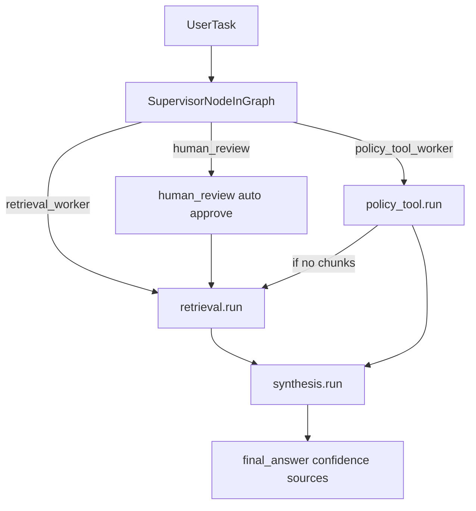

# System Architecture — Lab Day 09

**Nhóm:** 04  
**Ngày:** ___________  
**Version:** 1.1

## 1) TL;DR kiến trúc

- Pattern: `Supervisor -> Worker(s) -> Synthesis`.
- Orchestrator nằm ở `graph.py`, quản lý `AgentState`, route và trace.
- Worker thật đã có trong `workers/*.py` (retrieval, policy_tool, synthesis).
- `mcp_server.py` đã có 4 tool mock theo kiểu MCP dispatch.
- `graph.py` đã wire vào worker thật (`retrieval.run`, `policy_tool.run`, `synthesis.run`).
- Retrieval đã đồng bộ embedding Vertex (`text-multilingual-embedding-002`) với index Chroma, trả được chunks ổn định.

## 2) Sơ đồ luồng thực thi hiện tại

## 3) Thành phần và trạng thái triển khai

### `graph.py` (đang chạy mặc định)

| Thành phần | Vai trò | Trạng thái |
|---|---|---|
| `AgentState` | Shared state xuyên suốt run | Implemented |
| `supervisor_node()` | Rule-based routing + `route_reason` + `risk_high` + `needs_tool` | Implemented |
| `route_decision()` | Trả route cho conditional branch | Implemented |
| `human_review_node()` | HITL placeholder (auto-approve) | Placeholder |
| `retrieval_worker_node()` | Wrapper gọi `workers/retrieval.run` | Implemented |
| `policy_tool_worker_node()` | Wrapper gọi `workers/policy_tool.run` | Implemented |
| `synthesis_worker_node()` | Wrapper gọi `workers/synthesis.run` | Implemented |

### `workers/retrieval.py`

- Có `retrieve_dense()` dùng ChromaDB (`./chroma_db`) + embedding fallback.
- Trả `retrieved_chunks`, `retrieved_sources`, ghi `worker_io_logs`.
- Có thể test độc lập bằng `python workers/retrieval.py`.

### `workers/policy_tool.py`

- Có `analyze_policy()` xử lý exception chính: Flash Sale, digital product, activated.
- Có MCP calls qua `_call_mcp_tool()` -> `dispatch_tool()` của `mcp_server.py`.
- Có thể gọi `search_kb`, `get_ticket_info` tùy task và `needs_tool`.

### `workers/synthesis.py`

- Gộp evidence + policy context, gọi LLM (ưu tiên Gemini Vertex, fallback OpenAI, cuối cùng deterministic fallback).
- Ước tính confidence dựa trên chunk score + penalty exception + abstain signal.
- Trả `final_answer`, `sources`, `confidence`.

### `mcp_server.py`

| Tool | Mục đích |
|---|---|
| `search_kb` | Query KB (delegate retrieval, có fallback mock) |
| `get_ticket_info` | Lấy thông tin ticket từ mock ticket DB |
| `check_access_permission` | Kiểm tra điều kiện cấp quyền theo rule |
| `create_ticket` | Tạo ticket mock |

## 4) Shared state quan trọng để debug

| Field | Ý nghĩa | Ghi bởi | Đọc bởi |
|---|---|---|---|
| `task` | Câu hỏi đầu vào | init | supervisor/workers |
| `supervisor_route` | Worker route chính | supervisor | orchestrator/eval |
| `route_reason` | Lý do route để chấm trace | supervisor | docs/eval |
| `risk_high` | Cờ rủi ro cao | supervisor | human review branch |
| `needs_tool` | Cờ cần gọi MCP/tool | supervisor | policy worker |
| `workers_called` | Chuỗi worker đã chạy | graph/workers | eval/report |
| `mcp_tools_used` | Danh sách tool calls | policy worker | eval/report |
| `retrieved_sources` | Nguồn evidence | retrieval | synthesis/eval |
| `final_answer` | Câu trả lời cuối | synthesis | grading log |
| `confidence` | Độ tin cậy | synthesis | eval/report |
| `hitl_triggered` | Có vào nhánh HITL hay không | human_review | eval/report |
| `latency_ms` | Thời gian toàn pipeline | graph | eval/report |

## 5) Vì sao vẫn chọn supervisor-worker

| Tiêu chí | Day 08 single-agent | Day 09 supervisor-worker |
|---|---|---|
| Debugability | Khó tách lỗi retrieval/policy/synthesis | Dễ khoanh vùng theo worker |
| Khả năng mở rộng tool | Sửa prompt lớn | Thêm worker hoặc MCP tool |
| Trace routing | Hầu như không có | Có `supervisor_route` + `route_reason` |
| Quản trị rủi ro | Khó cài HITL theo điều kiện | Có nhánh `human_review` riêng |

## 6) Hiện trạng vs mục tiêu kế tiếp

| Hạng mục | Hiện trạng | Mục tiêu kế tiếp |
|---|---|---|
| Wiring worker thật trong graph | Đã xong, đang chạy thật | Giữ stable + tăng test coverage |
| HITL | Auto-approve placeholder | Pause/resume thật hoặc handoff thật |
| MCP usage trong default run | Có `mcp_tools_used` ở policy route | Tăng coverage cho câu multi-hop |
| Retrieval quality | Đã ổn định, trả top-k chunks theo source thật | Tối ưu relevance cho case multi-hop khó |
| So sánh Day08 vs Day09 | Có số liệu Day09, Day08 còn thiếu baseline | Bổ sung artifact Day08 để so sánh delta |

## 7) Checklist tự kiểm trước nộp

- Có `route_reason` rõ cho mọi câu trong trace/grading log.
- Không claim worker/MCP đã chạy nếu trace chưa chứng minh.
- Báo cáo nhóm/cá nhân trích dẫn đúng file + trace + giới hạn hiện trạng.
- `single_vs_multi_comparison.md` phân biệt rõ metric thật và metric placeholder.
