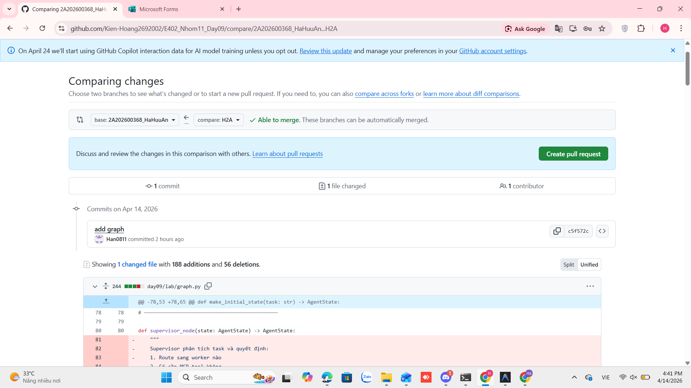

# Báo Cáo Cá Nhân — Lab Day 09: Multi-Agent Orchestration

**Họ và tên:** Hà Hữu An
**Vai trò trong nhóm:** Supervisor Owner
**Ngày nộp:** 15/04/2026  
**Độ dài yêu cầu:** 500–800 từ

---

> **Lưu ý quan trọng:**
> - Viết ở ngôi **"tôi"**, gắn với chi tiết thật của phần bạn làm
> - Phải có **bằng chứng cụ thể**: tên file, đoạn code, kết quả trace, hoặc commit
> - Nội dung phân tích phải khác hoàn toàn với các thành viên trong nhóm
> - Deadline: Được commit **sau 18:00** (xem SCORING.md)
> - Lưu file với tên: `reports/individual/[ten_ban].md` (VD: `nguyen_van_a.md`)

---

## 1. Tôi phụ trách phần nào? (100–150 từ)
> Mô tả cụ thể module, worker, contract, hoặc phần trace bạn trực tiếp làm.
> Không chỉ nói "tôi làm Sprint X" — nói rõ file nào, function nào, quyết định nào.

Trong lab này, tôi phụ trách xây dựng orchestrator chính của hệ thống multi-agent, chịu trách nhiệm điều phối luồng xử lý giữa các worker và đảm bảo tính toàn vẹn của dữ liệu.

**Module/file tôi chịu trách nhiệm:**
- File chính: `graph.py`
- Functions tôi implement: 
    - `supervisor_node()` — quyết định routing
    - `retrieval_worker_node()` — mock retrieval
    - `policy_tool_worker_node()` — rule-based policy engine
    - `synthesis_worker_node()` — tổng hợp output


Phần của tôi đóng vai trò điều phối toàn bộ hệ thống multi-agent, quyết định route giữa các worker dựa trên nội dung task. Ngoài ra, tôi cũng xây dựng logic retrieval đơn giản (keyword-based), policy rule engine, và synthesis để tổng hợp kết quả cuối cùng.

Công việc của tôi kết nối trực tiếp với:

- Worker layer (retrieval/policy)
- Pipeline execution flow
- Trace logging phục vụ debugging

Bằng chứng commit hình ảnh:

---

## 2. Tôi đã ra một quyết định kỹ thuật gì? (150–200 từ)

> Chọn **1 quyết định** bạn trực tiếp đề xuất hoặc implement trong phần mình phụ trách.
> Giải thích:
> - Quyết định là gì?
> - Các lựa chọn thay thế là gì?
> - Tại sao bạn chọn cách này?
> - Bằng chứng từ code/trace cho thấy quyết định này có effect gì?

**Quyết định:** Tôi chọn sử dụng keyword-based routing trong supervisor_node thay vì dùng LLM classification.

**Lý do:**
- Tốc độ nhanh hơn rất nhiều (không cần gọi API)
- Đủ chính xác cho domain nhỏ (policy / SLA / access)
- Dễ debug và trace rõ ràng

**Trade-off đã chấp nhận:**
- Không linh hoạt bằng LLM
- Khó scale với nhiều category hơn
- Phải maintain keyword list thủ công
- Không handle tốt các câu hỏi mơ hồ
- Phụ thuộc vào keyword → dễ miss edge cases

**Bằng chứng từ trace/code:**

```
python
# graph.py

# ...
elif any(kw in task for kw in policy_keywords):
    route = "policy_tool_worker"
```

## 3. Tôi đã sửa một lỗi gì? (150–200 từ)

> Mô tả 1 bug thực tế bạn gặp và sửa được trong lab hôm nay.
> Phải có: mô tả lỗi, symptom, root cause, cách sửa, và bằng chứng trước/sau.

**Lỗi:** Retrieval worker luôn trả về dữ liệu hardcode thay vì kết quả thực từ KB.
**Symptom (pipeline làm gì sai?):**
Dù query khác nhau, output luôn là:
```
SLA P1: phản hồi 15 phút, xử lý 4 giờ.
```
**Root cause (lỗi nằm ở đâu — indexing, routing, contract, worker logic?):**
Trong `retrieval_worker_node`, tôi đã build logic search (`results`) nhưng lại override bằng dữ liệu placeholder:
```python
state["retrieved_chunks"] = [
    {"text": "...", "source": "..."}
]
```

**Cách sửa:**

Thay bằng dữ liệu thật từ `results`:
```python
state["retrieved_chunks"] = results
state["retrieved_sources"] = list(set([r["source"] for r in results]))
```

**Bằng chứng trước/sau:**
> Dán trace/log/output trước khi sửa và sau khi sửa.

- Log trước khi sửa:
```
{
  "task": "Cần cấp quyền Level 3 để khắc phục P1 khẩn cấp. Quy trình là gì?",
  "route_reason": "task contains policy/access keyword | risk_high flagged",
  "risk_high": true,
  "needs_tool": true,
  "hitl_triggered": false,
  "retrieved_chunks": [
    {
      "text": "SLA P1: phản hồi 15 phút, xử lý 4 giờ.",
      "source": "sla_p1_2026.txt",
      "score": 0.92
    }
  ],
  "retrieved_sources": [
    "sla_p1_2026.txt"
  ],
  "policy_result": {
    "policy_applies": true,
    "policy_name": "refund_policy_v4",
    "exceptions_found": [],
    "source": "policy_refund_v4.txt"
  },
  "mcp_tools_used": [],
  "final_answer": "[PLACEHOLDER] Câu trả lời được tổng hợp từ 1 chunks.",
  "sources": [
    "sla_p1_2026.txt"
  ],
  "confidence": 0.75,
  "history": [
    "[supervisor] received task: Cần cấp quyền Level 3 để khắc phục P1 khẩn cấp. Quy trình là gì?",
    "[supervisor] route=policy_tool_worker reason=task contains policy/access keyword | risk_high flagged",
    "[policy_tool_worker] called",
    "[policy_tool_worker] policy check complete",
    "[retrieval_worker] called",
    "[retrieval_worker] retrieved 1 chunks",
    "[synthesis_worker] called",
    "[synthesis_worker] answer generated, confidence=0.75",
    "[graph] completed in 0ms"
  ],
  "workers_called": [
    "policy_tool_worker",
    "retrieval_worker",
    "synthesis_worker"
  ],
  "supervisor_route": "policy_tool_worker",
  "latency_ms": 0,
  "run_id": "run_20260414_103749"
}
```
- Log sau khi sửa:
```
{
  "task": "Cần cấp quyền Level 3 để khắc phục P1 khẩn cấp. Quy trình là gì?",
  "route_reason": "policy / access task",
  "risk_high": true,
  "needs_tool": true,
  "hitl_triggered": false,
  "retrieved_chunks": [
    {
      "text": "SLA P1: phản hồi 15 phút, xử lý 4 giờ.",
      "source": "sla_p1.txt",
      "score": 0.9
    },
    {
      "text": "Escalation P1 cần notify team lead ngay lập tức.",
      "source": "escalation.txt",
      "score": 0.9
    }
  ],
  "retrieved_sources": [
    "sla_p1.txt",
    "escalation.txt"
  ],
  "policy_result": {
    "policy_applies": true,
    "policy_name": "access_control_v2",
    "decision": "requires_approval",
    "reason": "Cấp quyền level cao cần approval",
    "source": "policy_access_control_v2.txt",
    "exceptions_found": []
  },
  "mcp_tools_used": [],
  "final_answer": "[Policy Decision] access_control_v2 → requires_approval. Lý do: Cấp quyền level cao cần approval\n\n[Evidence]\n- SLA P1: phản hồi 15 phút, xử lý 4 giờ. (source: sla_p1.txt)\n- Escalation P1 cần notify team lead ngay lập tức. (source: escalation.txt)",
  "sources": [
    "sla_p1.txt",
    "escalation.txt"
  ],
  "confidence": 0.95,
  "history": [
    "[supervisor] received task: cần cấp quyền level 3 để khắc phục p1 khẩn cấp. quy trình là gì?",
    "[supervisor] route=policy_tool_worker risk=True tool=True",
    "[policy_tool_worker] called",
    "[policy_tool_worker] policy=access_control_v2 decision=requires_approval",
    "[retrieval_worker] called",
    "[retrieval_worker] retrieved 2 chunks",
    "[synthesis_worker] called",
    "[synthesis_worker] generated answer | confidence=0.95",
    "[graph] completed in 0ms"
  ],
  "workers_called": [
    "policy_tool_worker",
    "retrieval_worker",
    "synthesis_worker"
  ],
  "supervisor_route": "policy_tool_worker",
  "latency_ms": 0,
  "run_id": "run_20260414_140240"
}
```
Sau khi sửa, hệ thống đã tổng hợp đúng thông tin từ nhiều worker, tạo ra câu trả lời đầy đủ và có tính giải thích, đúng với mục tiêu của kiến trúc multi-agent.

## 4. Tôi tự đánh giá đóng góp của mình (100–150 từ)

> Trả lời trung thực — không phải để khen ngợi bản thân.

**Tôi làm tốt nhất ở điểm nào?**

Tôi xây dựng được pipeline hoàn chỉnh từ supervisor → worker → synthesis, có trace rõ ràng và dễ debug.

**Tôi làm chưa tốt hoặc còn yếu ở điểm nào?**

Tôi chưa xử lý tốt các trường hợp edge cases và chưa tối ưu được hiệu năng của hệ thống.

**Nhóm phụ thuộc vào tôi ở đâu?** _(Phần nào của hệ thống bị block nếu tôi chưa xong?)_

Supervisor là trung tâm điều phối. Nếu routing sai, toàn bộ pipeline phía sau sẽ bị ảnh hưởng.

**Phần tôi phụ thuộc vào thành viên khác:** _(Tôi cần gì từ ai để tiếp tục được?)_

Tôi cần thành viên khác cung cấp các worker (retrieval, policy, synthesis) và đảm bảo tính toàn vẹn của dữ liệu được truyền giữa các worker.

---

## 5. Nếu có thêm 2 giờ, tôi sẽ làm gì? (50–100 từ)

> Nêu **đúng 1 cải tiến** với lý do có bằng chứng từ trace hoặc scorecard.
> Không phải "làm tốt hơn chung chung" — phải là:
> *"Tôi sẽ thử X vì trace của câu gq___ cho thấy Y."*

Tôi sẽ cải thiện `supervisor_node` bằng cách thêm cơ chế scoring thay vì match keyword cứng.

**Lý do:**
Trace cho thấy query có cả “P1” và “cấp quyền” nhưng luôn route về policy, có thể làm mất context từ retrieval.

**Giải pháp:**

- Gán weight cho từng keyword
- Chọn route có score cao nhất

Cách này giúp xử lý tốt hơn các query có nhiều intent.
---

*Lưu file này với tên: `reports/individual/[ten_ban].md`*  
*Ví dụ: `reports/individual/nguyen_van_a.md`*
