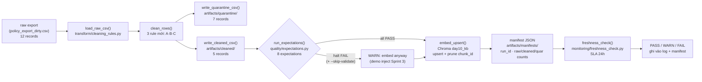

# Kiến trúc pipeline — Lab Day 10

**Nhóm:** C401-Y3  
**Cập nhật:** 2026-04-15

---

## 1. Sơ đồ luồng

> **Freshness** đo trường `latest_exported_at` (max `exported_at` trong cleaned) so với wall-clock tại runtime.  
> **run_id** ghi vào: log filename, manifest JSON, và metadata `run_id` của mỗi chunk trong Chroma.  
> **Quarantine** lưu tại `artifacts/quarantine/quarantine_<run_id>.csv` — không embed, giữ để audit/review.

---

## 2. Ranh giới trách nhiệm

| Thành phần | Input | Output | Owner nhóm |
|------------|-------|--------|------------|
| **Ingest** | `data/raw/policy_export_dirty.csv` (12 records) | list[dict] raw rows + raw_count | Ingestion Owner |
| **Transform** | raw rows + flag `apply_refund_window_fix` | cleaned list (5) + quarantine list (7) | Cleaning / Quality Owner |
| **Quality** | cleaned rows | list[ExpectationResult], `should_halt` bool | Cleaning / Quality Owner |
| **Embed** | cleaned CSV path, run_id | Chroma upsert (5 ids) + prune stale ids | Embed Owner |
| **Monitor** | manifest JSON path + SLA_HOURS env | status PASS/WARN/FAIL + detail dict | Monitoring / Docs Owner |

---

## 3. Idempotency & rerun

Pipeline dùng `chunk_id` ổn định = `SHA-256("{doc_id}|{chunk_text}|{seq}")[:16]`, đảm bảo cùng nội dung → cùng ID.

**Mỗi lần run:**
1. **Upsert** tất cả `chunk_id` trong cleaned batch hiện tại.
2. **Prune** các `chunk_id` có trong collection nhưng không còn trong batch này → xóa vector cũ.
3. Kết quả: chạy 2 lần liên tiếp với cùng CSV → collection giống hệt (không tăng số vector, không duplicate).

> Quan sát được trong log: `embed_prune_removed=5` lần đầu khi collection còn id từ sprint1; sau đó `embed_upsert count=5` ổn định.

---

## 4. Liên hệ Day 09

Pipeline Day 10 dùng thư mục `data/docs/` chung nhưng viết vào Chroma collection **`day10_kb`** (riêng biệt với `day09_kb` của Day 09). Điều này cho phép:

- Agent Day 09 vẫn hoạt động bình thường trên collection cũ trong khi pipeline Day 10 đang clean/re-embed.
- Sau khi xác nhận `day10_kb` đã PASS đủ expectation và eval trước khi cut-over, agent chỉ cần đổi biến `CHROMA_COLLECTION=day10_kb` để phục vụ lại với dữ liệu đã được chuẩn hoá.

> Tích hợp thực tế: cùng `.env` điều khiển `CHROMA_DB_PATH` và `CHROMA_COLLECTION` cho cả hai pipeline.

---

## 5. Rủi ro đã biết

- **Freshness FAIL liên tục:** `latest_exported_at = 2026-04-10T08:00:00` trong raw mẫu — luôn vượt SLA 24h khi chạy sau ngày 11/04/2026. Cần batch export mới từ source thực.
- **Inject bypass Rule A:** `--no-refund-fix` chỉ nguy hiểm nếu chunk "14 ngày" không có migration marker; Rule A vẫn lọc được nếu marker hiện diện (xem Sprint 3).
- **alert_channel chưa thật:** `freshness_check` ghi log nhưng `alert_channel: "__TODO__"` trong contract — chưa có webhook/email thực sự.
- **Single file raw:** pipeline chỉ test với 12 dòng mẫu; chưa có stress test với volume lớn hoặc encoding BOM.
