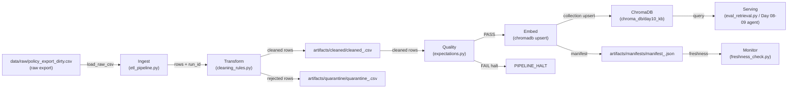

# Kiến trúc pipeline — Lab Day 10

**Nhóm:** Nhóm 11 — Lớp 402  
**Cập nhật:** 15-4-2026

---

## 1. Sơ đồ luồng

**Điểm đo freshness:** sau bước Embed — `latest_exported_at` từ cleaned rows ghi vào manifest, freshness_check so sánh với `now()` theo `FRESHNESS_SLA_HOURS` (mặc định 24h).  
**run_id:** sinh tự động theo UTC timestamp hoặc truyền `--run-id`. Xuất hiện trong log, manifest, và tên file cleaned/quarantine.  
**Quarantine:** file riêng `artifacts/quarantine/quarantine_<run_id>.csv` — mỗi dòng kèm cột `reason`.

---

## 2. Ranh giới trách nhiệm

| Thành phần | Input | Output | Owner nhóm |
|------------|-------|--------|--------------|
| Ingest | `data/raw/*.csv` | list raw dicts + run_id | Ingestion Owner |
| Transform | raw dicts, flag `apply_refund_window_fix` | (cleaned list, quarantine list) | Cleaning/Quality Owner |
| Quality | cleaned list | (ExpectationResult[], should_halt) | Cleaning/Quality Owner |
| Embed | cleaned CSV, run_id | ChromaDB upsert + prune log | Embed/Idempotency Owner |
| Monitor | manifest JSON, SLA hours | (status, detail dict) | Monitoring/Docs Owner |

---

## 3. Idempotency & rerun

Embed dùng `col.upsert(ids=chunk_ids, ...)` — `chunk_id` được tính bằng SHA-256 16 ký tự của `doc_id|chunk_text|seq`. Cùng nội dung → cùng `chunk_id` → upsert không tạo bản ghi trùng.

Ngoài ra, trước mỗi upsert pipeline lấy toàn bộ id đang có trong collection (`col.get(include=[])`), tính hiệu `prev_ids - current_ids` rồi gọi `col.delete(ids=drop)`. Điều này đảm bảo **index = snapshot publish**: sau rerun không còn vector id của chunk đã bị quarantine.

Kết quả: chạy `python etl_pipeline.py run` hai lần liên tiếp → `embed_prune_removed=0` lần thứ 2 nếu dữ liệu không đổi.

---

## 4. Liên hệ Day 09

Corpus `data/docs/*.txt` (5 tài liệu) dùng chung. Tuy nhiên vector store Day 10 (`chroma_db/day10_kb`) nhận data từ **cleaned CSV** (ETL pipeline), không đọc trực tiếp `data/docs/`. Điểm khác biệt:

- **Day 08/09:** embed toàn bộ file `.txt` gốc không qua cleaning pipeline.
- **Day 10:** chunk đi qua `cleaning_rules.py` → quarantine chunk stale → chỉ embed chunk đã kiểm soát chất lượng.

Agent Day 09 nên dùng collection Day 10 làm nguồn retrieval để đảm bảo policy đúng version.

---

## 5. Rủi ro đã biết

- `chunk_id` tính theo seq (thứ tự trong CSV): nếu thứ tự dòng thay đổi giữa các run, chunk_id có thể đổi dù nội dung như cũ → upsert tạo bản mới, cũ bị prune. Cần kiểm soát sort order CSV.
- Freshness SLA đo theo `latest_exported_at` do source system ghi. Nếu source ghi sai timestamp, freshness FAIL không phản ánh thực tế.
- ChromaDB persistent client không có lock file — tránh chạy 2 process song song trên cùng `chroma_db/`.
