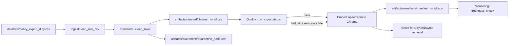

# Kiến trúc pipeline — Lab Day 10

**Nhóm:** 04 - E402  
**Cập nhật:** 2026-04-15

---

## 1. Sơ đồ luồng

**Điểm observability chính:**
- `run_id` được ghi vào log runtime và manifest để truy vết mọi artifact theo từng lần chạy.
- `quarantine_records` tách riêng file CSV, không có silent drop.
- Freshness được đo bằng `monitoring/freshness_check.py` dựa trên `exported_at` mới nhất trong cleaned.

---

## 2. Ranh giới trách nhiệm

| Thành phần | Input | Output | Owner nhóm |
|------------|-------|--------|------------|
| Ingest | `data/raw/policy_export_dirty.csv` | List rows raw trong memory + `raw_records` metric | Ingestion Owner |
| Transform | Raw rows | `cleaned_<run_id>.csv`, `quarantine_<run_id>.csv` | Cleaning/Quality Owner |
| Quality | Cleaned rows | expectation results + `should_halt` | Cleaning/Quality Owner |
| Embed | Cleaned rows pass validate (hoặc skip validate khi inject) | Chroma collection `day10_kb`, `embed_prune_removed` metric | Embed Owner |
| Monitor | `manifest_<run_id>.json` | `freshness_check` PASS/WARN/FAIL | Monitoring/Docs Owner |

---

## 3. Idempotency & rerun

Pipeline dùng **upsert theo `chunk_id`** vào Chroma và có bước **prune ID không còn trong cleaned snapshot**.  
Hệ quả:
- Chạy lại cùng dữ liệu không làm phình vector store.
- Khi inject lỗi (`--no-refund-fix --skip-validate`), chunk stale thay thế chunk sạch (quan sát được `embed_prune_removed=1`).
- Khi rerun clean, chunk stale bị loại và index trở về trạng thái đúng (`embed_prune_removed=1` lần nữa).

Điều này đáp ứng yêu cầu publish boundary của Day10: vector store luôn phản ánh snapshot cleaned mới nhất.

---

## 4. Liên hệ Day 09

Day09 là orchestration layer đọc từ retrieval/index. Day10 là tầng dữ liệu bảo đảm index đó không bị stale hoặc mâu thuẫn version.  
Nhóm dùng cùng case `CS + IT Helpdesk`; sau khi chạy Day10, collection `day10_kb` có thể được Day09 policy/retrieval worker dùng trực tiếp hoặc được sync sang collection Day09 tuỳ kiến trúc nhóm.  
Điểm quan trọng là Day10 cung cấp `run_id`, manifest và quality evidence để Day09 trace giải thích được "vì sao retrieval trả về version này".

---

## 5. Rủi ro đã biết

- `chunk_id` hiện phụ thuộc `seq`; khi thứ tự ingest thay đổi lớn thì ID cũng đổi, gây churn vector cao hơn cần thiết.
- Freshness mới đo ở 1 boundary (publish), chưa tách riêng ingest boundary và publish boundary.
- Evaluation hiện thiên về retrieval keyword signals (`contains_expected`, `hits_forbidden`), chưa đo chất lượng answer cuối bằng LLM-judge.
